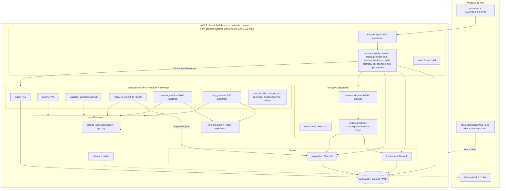

# Earn Console & Autonomy v2 — Build Spec

Repo `shouryasal/momentum`, branch `claude/code-building-plan-qxzqsg` (all work lands on this branch; it is
`git.live_branch`). Target runtime: WSL2 Ubuntu 24.04 (Python 3.12), Node 22, Docker, two Freqtrade 2026.8
containers, one local web console. This document is the implementation contract: engineers build from it
directly, package by package.

Verified against the code at HEAD (not only the repo map): `ops/config.py`, `ops/db.py`, `ops/sql/*.sql`,
`ops/gen_freqtrade_config.py`, `ops/docker-compose.yml`, `ops/envwrap.sh`, `ops/crontab`, `ops/healthcheck.py`,
`ops/lib/{kill,claude_auth,freqtrade_api,locks,flags,tg}.py`, `runs/{router,decision_core,research_run,triggers,
ingest,apply_changes,review_run,common}.py`, `strategies/{earn_base,riskgate,SleeveA,SleeveB,proposal_loader,
_journal,sleeve_common}.py`, `.claude/hooks/*`, `.claude/settings.json`, `schemas/*`, `evals/*`, `pyproject.toml`.

---

## 1. Summary of decisions

**Authority and safety**

1. **Mode lives in a signed file, not in config.** `var/state/mode.json` holds per-sleeve mode (TEST / LIVE_PROPOSE /
   LIVE_EXECUTE), run id and seed, HMAC-signed with `EARN_CONSOLE_SECRET`. Only the console process and the human CLI
   hold that secret (it is in **no** `envwrap.sh` allowlist; a test asserts this). Missing file, bad JSON, bad
   signature or missing secret ⇒ every sleeve is **TEST** (fail closed). Unlike a one-shot "arm token", the signed
   state survives every later regeneration, so a config save can never silently drop a live bot to dry-run.
   `earn.yaml: phase` is deleted as a stored key; `EarnConfig.phase` becomes a computed property derived from mode
   state (legacy `phase:` in a file is accepted and ignored with a warning).
2. **Committed generated configs stay committed.** `config/freqtrade-{a,b}.json` and `config/riskgate.json` remain
   deterministic renders of `earn.yaml` (drift check and `test_config_sync` survive). Machine-local, mode-dependent
   output goes to `var/runtime/` (gitignored, mounted read-only into the containers) as a second `--config` overlay
   plus a `runtime-<sleeve>.json` the strategy reads. This kills the "delete the generated configs" migration risk
   the judgement flagged while keeping live-ness out of git.
3. **NAV is ledger NAV, not wallet NAV.** The gate's NAV is the bot's own capital: `starting_balance + realized
   closed profit + realized/unrealized P&L of bot-owned open trades`, with USDT reserved in open entry orders
   counted. It ignores anything else on the exchange account. This fixes the HIGH "NAV ignores USDT in open orders"
   and the cross-sleeve/shared-account contamination gap in one move. If the freqtrade objects it needs are missing,
   `PortfolioState.valid=False` and the new first gate check `nav_valid` blocks entries (fail closed).
4. **One live sleeve per exchange account**, enforced by a blocking preflight check on the Binance account UID, plus
   a **balance reconciliation** job (ledger vs exchange) at go-live, after every live bot start and every 15 minutes.
   A mismatch above tolerance sets a `reconcile_mismatch` block_entries flag and raises a critical alert.
5. **Exchange-side stops in live.** `stoploss_on_exchange` is required (preflight-blocking) whenever a sleeve is live,
   so a laptop, WSL or Docker outage cannot leave a position unprotected. Preflight also blocks live while Windows can
   sleep on AC or the WSL keep-alive task is missing.
6. **One operations lock.** `ops/locks/ops.lock` (flock, shared by shell and Python) serialises mode transitions,
   test-run resets, config apply/regeneration/restart, crontab install, and `apply_changes` merges. The kill switch
   never waits for it.
7. **Automated runs still cannot touch tier 2.** Review/daily sessions run in a **git worktree** off `live_branch`
   with `EARN_STATE_ROOT` pointing at the live data root and data dirs symlinked in; `apply_changes` (under the ops
   lock, in the live checkout) is the only automated writer of the live HEAD. Evidence is **recomputed** by
   `evals/verify_change.py`; the model's claimed numbers are stored but never gate anything.

**Capability**

8. **Provider-agnostic LLM layer** (`runs/llm/`) with Claude Agent SDK (subscription **or** Console API key,
   selectable: `subscription | api_key | auto`) and **local Ollama** as first-class providers; per-task ordered
   chains, a `min_tier` floor so a local model can never write a proposal or a validation, DB-backed circuit
   breakers, and automatic switching on error/timeout/rate-limit/budget/provider-down/schema-invalid/escalation —
   every switch journaled in `provider_switches` and visible in the UI. In `auto` mode the API key reaches jobs only
   as `EARN_FALLBACK_ANTHROPIC_API_KEY` (the CLI can never pick it up implicitly) and metered spend is bounded by a
   hard `auth.api_key_monthly_cap_usd`.
9. **Tiered signal pipeline**, built on the existing `runs/triggers.py` (its five conditions become detectors, its
   `guards()` stays the single guard implementation): deterministic detectors → cheap screener (llama3.1:8b, Haiku
   fallback, gray-zone escalation) → strong validator (Sonnet→Opus, read-only tools) → planner (`research_run
   --signal-id`) → deterministic gate → Freqtrade. Signal outcomes are resolved after their horizon and
   `evals/signal_replay.py` turns them into real precision/recall evidence for scanner/validator prompt changes.
   `signals.planner.enabled: false` gives an observe-only rollout.
10. **Test vs Live in the UI, per sleeve.** TEST = Freqtrade dry-run on live market data with a UI-set seed, a
    per-run Freqtrade DB (`runs/<run_id>.sqlite`), run-scoped risk state, NAV vs BTC benchmark, reset & compare, and
    TCA-calibrated caveats next to P&L. LIVE = real orders after a 13-item preflight, typed confirmation and step-up,
    with `propose` (Telegram/UI approval required, HMAC-verified by the in-container loader) and `execute` sub-modes.
11. **Trading mechanics are configurable but tier-2 (human-only)**: order types/offsets, fixed + trailing + ATR
    stops, ROI table, partial take-profit ladder, DCA/averaging-down, pyramiding, re-entry cooldown, rebalance
    band — all bounded by `risk.*` ceilings, all routed through `check_entry`/`cap_stake`, all clamped to the
    target weight, and all subject to new churn/turnover/fee-budget gate checks.
12. **Everything set in code becomes config**: stage prompts (flags/brief/brief_short/classify/scan/validate) move to
    `prompts/stages/*.md`, news keyword tables, ingest timeframes, strategy timeframe/startup candles, protections,
    per-task skills and tool profiles, schedules and research slots. True invariants (`EFFORT_FLOOR`,
    `ALWAYS_DISALLOWED`, market-only stop exits, the 127.0.0.1 bind, tier-2 list) stay in code and are shown
    read-only on an **Invariants** page with the `file:function` that enforces each.
13. **Console = FastAPI + React 18/Vite/TS/Mantine v7**, bound to 127.0.0.1 only, token login → signed session
    cookie, Host/Origin + CSRF checks, step-up re-auth for dangerous actions, never returns a secret value, refuses
    to start (and refuses every mutating route) when `EARN_AUTOMATED_RUN=1`. Config forms are generated from the
    pydantic JSON Schema of `earn.yaml`/`models.yaml`, so a new field appears in the UI with no frontend change.
14. **Host reality is part of the design**: the runtime checkout must be on WSL ext4 (never the OneDrive/`/mnt/c`
    copy — SQLite WAL and git worktrees corrupt there); `ops/setup.sh` creates every runtime dir; crontab and systemd
    units are *generated* with the real path and venv PATH; Windows autostart/keep-alive/sleep settings are scripted
    and checked; SQLite gets a documented busy-timeout/retry policy with a contention test.
15. **Freqtrade 2026.8 API specifics are pinned by a contract test in the foundation package** (`show_config` fields,
    `stopentry`/`stopbuy`, locks DELETE, trade custom data, `available_capital`, partial-exit `adjust_trade_position`,
    `stoploss_on_exchange`), so the six packages that depend on them cannot drift.

---

## 2. Architecture and data flows



### 2.1 Signal pipeline (data flow)

```
ingest (*/15)  -> knowledge.db candles/books/funding/news  -> knowledge/state/freshness.json (atomic, stdlib-readable)
                                                            -> signals.pipeline.on_ingest()  [when signals.integration=pipeline]
scanner (*/5, flock 'scanner', deadline 240s)
  1 features.build(kdb, cfg)              pure python: 1h/4h/1d returns, RSI, ATR%, rvol, MA200 distance,
                                          20d breakout, volume z, funding, OI delta, spread, drawdown, news counts
  2 detectors.run_all(features, cfg)      the five moved from TriggerEngine (news_event, regime_flip, move,
                                          near_stop, funding) + breakout, rsi_extreme, volume_spike,
                                          dip_from_high, ma_cross -> Candidate(detector, pair, direction, strength)
  3 dedupe(dedupe_key = detector:pair:direction:bucket(dedupe_minutes)) -> INSERT signals(status='candidate')
  4 fast_path (near_stop, news:hack|depeg|delist) -> status 'valid' by rule, skip the screener AND the validator
  5 screen  llm.run_task('scan')          chain [local_small, haiku]; batch <= max_candidates_per_cycle;
                                          schema schemas/signal_screen.json; host verifies every cited feature_key
                                          exists and every news_hash is real; gray-zone score -> re-run on next chain
                                          entry (reason 'escalate:gray_zone'); novel items need >=1 corroborated hash
  6 score = detector_weight*detector_score + screen_weight*screen_score  (screen down -> detector score alone, noted)
     status 'screened' (>= min_score) | 'screened_out'
  7 spawn detached: flock -n ops/locks/validate.lock timeout <deadline> envwrap.sh signals -- python -m runs.signals validate
validate_signal (one at a time, deadline 600s)
  8 evidence pack (deterministic JSON, saved to journal/snapshots/signals/<id>/pack.json)
  9 llm.run_task('validate')              chain [sonnet, opus]; min_tier 3 (no local model may validate);
                                          read-only tools + skills market-state/asset-dossier for Claude;
                                          pack-only for local; schema schemas/signal_validation.json
 10 row in signal_validations; act iff verdict=valid AND confidence >= min_confidence AND suggested.direction != hold
 11 TriggerEngine.guards()                kill / cooldown_hours / max_per_day / stale_data — the SAME implementation
 12 fire: envwrap research -- python -m runs.research_run <HHMM> --triggered-by signal:<id> --signal-id <id>
research_run (planner)
 13 decide stage gets a VALIDATED SIGNAL block (candidate + features + validator thesis + invalidation);
    force_escalation; proposal validated host-side, written atomically, journaled with signal_id
 14 SleeveB bot_loop_start -> targets -> custom_stake_amount / adjust_trade_position -> RiskGate -> order
 15 daily_review postflight resolves outcomes after horizon_hours (outcome_ret, outcome_hit) -> funnel stats,
    evals/signal_replay.py scores candidate scan/validate prompts against resolved outcomes (replay_runs row)
```

### 2.2 Mode switch (data flow)

```
UI Mode page -> POST /api/mode/preflight {sleeve,target,submode,seed}
             -> 13 checks (section 8.3), preflight_id valid 10 min
             -> POST /api/mode/transition {preflight_id, confirm_phrase, step-up cookie}
ops.modes.transition() [requires HumanActor + EARN_CONSOLE_SECRET; raises under EARN_AUTOMATED_RUN=1]
  1 acquire ops.lock (30s wait)                      9 wait for /ping + /health, then verify /show_config:
  2 re-run preflight (must still pass)                 dry_run, strategy, bot_name, seed, db_url,
  3 POST /stopentry; cancel open entry orders          stoploss_on_exchange (live) — mismatch => rollback + KILL
  4 (disarm only) forceexit all + wait flat          10 (live) reconcile ledger vs exchange; mismatch => rollback
  5 close sleeve_runs row + final metrics            11 insert new sleeve_runs row (new run_id, seed, mode)
  6 write signed var/state/mode.json                 12 audit_log + mode_transitions rows, release lock
  7 gen_freqtrade_config -> var/runtime/*            Each step appended to mode_transitions.steps_json and
  8 docker compose up -d --force-recreate <svc>      streamed to the UI over SSE (topic 'mode').
```

### 2.3 Self-improvement (data flow)

```
review_run (Sun 20:00) / daily_review (21:30)
  worktree.create(kind, key)  -> git worktree add -B review/<week> ../earn-worktrees/review-<week> <live_branch>
                              -> symlink data dirs (knowledge, journal, reports, changes, proposals[ro]) to live root
  session: cwd=worktree, env EARN_STATE_ROOT=<live root>, EARN_WORKTREE=<wt>, narrowed Bash allowlist
        -> edits tier-1 files IN THE WORKTREE, commits on its branch, runs make_change.py
changes/<id>.json (status proposed, what.commit, what.op, branch, worktree)
apply_changes (postflight, live checkout, ops lock)
  check(): schema -> tier 1 -> target/commit not tier-2 -> bounds recomputed from the commit diff ->
           author_model == runs.served_model(author_run_id) -> VERIFIED evidence (evals/verify_change.py:
           backtest + walk-forward for params, replay in the candidate worktree for prompt/skill,
           counterfactual computed from replay, skill lint + skill tests + skill eval for skill kinds) ->
           replay row from DB -> monthly param budget -> tier1_freeze -> autonomy.kinds[kind][mode]
  merge(): git cherry-pick -x <commit> onto live_branch in the live checkout (HEAD must equal live_branch,
           tier-1 paths clean); conflict => HELD (never 'rejected'); tag change/<id>; merge_tier0() for
           knowledge-only commits; change_events row
  revert(): git revert --no-edit <merge_commit> (human button, or auto_revert request from daily_review)
```

---

## 3. Config schema additions

`config_version: 2`. Every field carries `Field(description=..., json_schema_extra={...})` with these UI
annotations, consumed verbatim by `SchemaForm`:

| key | meaning |
|---|---|
| `x-tier` | `human` (tier 2), `tier1`, `generated`, `invariant` |
| `x-group` | UI group inside the section |
| `x-protected` | needs step-up + typed confirm; changes the bless digest |
| `x-effects` | `["regen","restart:freqtrade-a","restart:freqtrade-b","crontab","restart:telegram","restart:console","reset_required"]` |
| `x-unit` | `fraction`, `pct`, `usdt`, `minutes`, `hours`, `days`, `bps` |
| `x-widget` | `slider`, `cron`, `time`, `duration`, `path`, `model-ref`, `skill-ref`, `pair`, `secret-ref` |
| `x-help-md` | long help shown in a popover |

A foundation test walks the generated JSON Schema and fails if any leaf lacks `description`, `x-tier` or `x-group`.

### 3.1 `config/earn.yaml` (new and changed sections)

```yaml
meta: { config_version: 2, display_timezone: "Asia/Dubai" }
# phase: REMOVED (computed from var/state/mode.json). A legacy `phase:` key loads with a warning and is ignored.

runtime:                              # x-tier human, checked by setup + preflight + Operations page
  data_root: null                     # null = repo root; must be ext4 (9p/drvfs refused)
  docker: { runtime: engine, compose_project: earn }     # engine | desktop
  require_host_awake_for_live: true   # powercfg standby-timeout-ac must be 0
  require_keepalive_task_for_live: true

console:
  port: 8765                          # host is a code Literal "127.0.0.1" (invariant, not configurable)
  session_hours: 12
  stepup_minutes: 10
  git_commit_on_save: true
  effects_default: apply_now          # apply_now | save_only
  poll_ms: { db: 2000, bots: 10000 }

git:
  live_branch: claude/code-building-plan-qxzqsg
  worktree_root: "../earn-worktrees"
  worktree_ttl_days: 14

security:
  agent_user: null                    # e.g. "earn-agent" once ops/setup_agent_user.sh has run
  agent_cli_wrapper: null             # "ops/agent_cli.sh" — required for LIVE_EXECUTE
  console_bind_note: "127.0.0.1 only (invariant)"

autonomy:
  tier1_auto_merge: true              # master switch; false = everything HELD
  kinds:                              # kind -> {test|live: auto|approve|off}   (live overrides via live_forces_human)
    params:     { test: auto,    live: approve }
    prompt:     { test: auto,    live: approve }
    skill_edit: { test: auto,    live: approve }
    skill_new:  { test: approve, live: approve }   # with scripts/**: ALWAYS approve (code invariant)
    skill_bind: { test: approve, live: approve }
    model:      { test: approve, live: approve }
    revert:     { test: auto,    live: auto }      # restoring a previously approved state
  live_forces_human: true
  max_auto_merges_per_week: 5
  auto_revert: { enabled: true, window_days: 7, validity_drop_pct: 10, breach_increase: 1 }

sleeves:
  a: { label: rules,  strategy: SleeveA }          # was Scaffold (HIGH fix)
  b: { label: claude, strategy: SleeveB }
  benchmark: { label: hold_btc, pair: "BTC/USDT" }
  # sleeves.*.capital_usdt REMOVED -> modes.test.seed_usdt / the live seed in var/state/mode.json.
  # ops.config.seed_for(cfg, sleeve) is the single reader; a deprecated alias property keeps old call sites alive
  # until their owning package migrates.

modes:
  test:
    seed_usdt: { a: 10000, b: 10000 }              # default seed for the NEXT test run (x-effects: reset_required)
    label: "baseline"
    simulate_approval: false                       # rehearse propose-mode approvals in TEST
    benchmark_from_run_start: true
  live:
    max_seed_usdt: { a: 1000, b: 1000 }            # x-protected hard ceiling enforced by preflight
    min_test_days: 90                              # planning doc section 10 (G3); override needs a typed reason
    min_propose_days: 30                           # before LIVE_EXECUTE (G6)
    require_zero_breach_days: 30
    submode_default: propose
    approval_ttl_hours: 6
    flatten_on_exit: true
    require_agent_user_for_execute: true
    require_stoploss_on_exchange: true
    one_live_sleeve_per_account: true
    confirm_phrase: "GO LIVE {sleeve} {seed} USDT"

risk:                                              # all x-protected, x-tier human
  # ...every existing key unchanged (max_weight, max_gross_exposure, usdt_floor, daily_loss_stop,
  #    daily_stop_lock_hours, monthly_loss_stop, max_trades_per_day, stoploss_guard, cooldown_candles,
  #    staleness_minutes, min_notional_usdt, stoploss_per_trade, blackout, kill_file)...
  max_entries_per_trade: 4            # initial + DCA + pyramid adds
  max_order_notional_pct: 0.20        # single order <= 20% of ledger NAV
  max_orders_per_day: 12              # discretionary orders per sleeve per Gulf day (risk exits exempt)
  max_turnover_pct_per_day: 0.50      # traded notional / NAV per Gulf day
  max_fee_pct_per_month: 0.01         # 1% NAV/month fee budget (matches G2/G3)
  market_entries_allowed: false       # market ENTRY orders need an explicit human opt-in
  protections: { max_drawdown: { lookback_candles: 6, trade_limit: 2 } }
  reconcile: { tolerance_pct: 0.005, dust_usdt: 10.0, block_on_mismatch: true }

trading:                              # x-tier human, x-effects regen+restart; every value bounded by risk.*
  timeframe: "4h"
  startup_candles: auto               # auto => (bounds['sleeve_a.trend.ma_days'].max + 20) days of 4h candles
  defaults:
    sizing_mode: target_weight        # target_weight | signal_entries
    order_types: { entry: limit, exit: limit }     # stoploss/emergency_exit/force_exit are market (invariant)
    entry_price: { side: bid, offset_bps: 0 }
    exit_price:  { side: ask, offset_bps: 0 }
    reprice_on_timeout: false
    stoploss:
      fixed_pct: 0.10                 # validator: <= risk.stoploss_per_trade (the loosest allowed)
      on_exchange: auto               # auto => true in LIVE (required), false in TEST
      trailing: { enabled: false, activate_profit_pct: 0.04, distance_pct: 0.03, only_offset_reached: true }
      atr: { enabled: false, period: 14, mult: 3.0, timeframe: "4h" }
      reentry_cooldown_hours: 24      # after a stop/TP exit, no re-entry unless a NEWER proposal exists
    take_profit:
      roi_table: { "0": 10.0 }        # minutes -> profit; 10.0 = effectively off (today's behaviour)
      ladder: []                      # e.g. [{at_profit_pct: 0.10, sell_fraction: 0.25}, ...]
    dca:      { enabled: false, max_adds: 2, step_pct: 0.05, size_multiplier: 1.0, cooldown_hours: 24,
                only_if_regime_up: true }
    pyramid:  { enabled: false, max_adds: 1, trigger_profit_pct: 0.05, size_multiplier: 0.5, cooldown_hours: 24 }
    scheduled_dca: { enabled: true, interval_days: 7, chunk_pct_nav: 0.05 }   # SleeveA's existing weekly DCA
    rebalance: { min_interval_hours: 4, band_source: execution }
    exchange_limits: { respect_min_stake: true, full_exit_below_min: true, backoff_minutes: [15, 60, 240] }
  sleeves:
    a: { dca: { enabled: false } }    # deep-merged over defaults
    b: {}
  plan_bounds:                        # clamps for the optional proposal.plan block
    stop_pct: { min: 0.03, max: 0.15 }
    take_profit_pct: { min: 0.03, max: 0.50 }
    allowed_entry_styles: [passive, cross]
    allow_model_urgency: false

research:
  slots: ["08:30", "16:00"]           # THE single source: cron lines, nearest_slot and the healthcheck artifact
  deadline_s: 2400                    # cron timeout stays 1800+postflight margin; see ops.schedules
  stage_deadlines_s: { flags: 240, brief: 360, decide: 900, shadow: 240 }   # sum <= deadline_s - 120
  postflight_margin_s: 120
  prompt_version: research.v3         # no longer hard-wired in runs/build_prompt.py
  stage_prompts:                      # code constants moved to files (tier 1, editable in the UI)
    flags: prompts/stages/flags.v1.md
    brief: prompts/stages/brief.v1.md
    brief_short: prompts/stages/brief_short.v1.md
    classify: prompts/stages/classify.v1.md
    scan: prompts/stages/scan.v1.md
    validate: prompts/stages/validate.v1.md

signals:
  enabled: true
  integration: pipeline               # legacy (today's TriggerEngine behaviour) | pipeline
  scanner:
    cron: "*/5 * * * *"
    run_after_ingest: true
    deadline_s: 240
    dedupe_minutes: 240
    max_candidates_per_cycle: 5
    detectors:
      news_event:        { enabled: true, events: [hack, depeg, delist, lawsuit, outage], corroborated_only: true,
                           fast_path_events: [hack, depeg, delist] }
      regime_flip:       { enabled: true }
      move:              { enabled: true, pct: { "1h": 2.5, "4h": 5.0, "24h": 8.0 } }
      near_stop:         { enabled: true, fast_path: true }
      funding:           { enabled: true, abs_8h: 0.0010 }
      breakout:          { enabled: true, tf: "1d", lookback: 20, confirm_close: true }
      rsi_extreme:       { enabled: true, tf: "4h", period: 14, low: 25, high: 75 }
      volume_spike:      { enabled: true, tf: "1h", zscore: 3.0, lookback: 72 }
      dip_from_high:     { enabled: true, tf: "1d", pct: 12.0, lookback_days: 30 }
      ma_cross:          { enabled: false, tf: "1d", fast: 50, slow: 200 }
    screen: { enabled: true, task: scan, min_score: 0.60, gray_zone: [0.45, 0.65], allow_novel: true,
              news_since_min: 60 }
    scoring: { detector_weight: 0.6, screen_weight: 0.4 }
  validator:
    task: validate
    min_confidence: 0.65
    max_per_day: 6
    cooldown_min_per_asset: 120
    expire_after_min: 90
    deadline_s: 600
  planner:
    enabled: true                     # false = observe mode: validate but never fire research
    min_verdict: valid
    max_per_day: 3                    # replaces triggers.max_per_day (legacy key still accepted)
    cooldown_hours: 4
  outcomes: { resolve_after_hours: 24, measure_tf: "1h" }

triggers:                             # kept for back-compat; loader maps into signals.* and warns
  enabled: true

ingest:
  timeframes: ["1h", "4h", "1d"]
  cold_start_days: 7
news:
  # ...existing window_hours / min_sources / whitelist...
  event_keywords: { hack: [...], depeg: [...], delist: [...], lawsuit: [...], outage: [...] }   # moved from code
  asset_keywords: { BTC: [bitcoin, btc], ETH: [ethereum, "eth ", "ether "] }                     # must cover universe

skills:
  bindings:                           # human base (tier 2); tier-1 overlay: config/skills-registry.auto.yaml
    research.flags: [reg-watch]
    research.brief: [crypto-brief]
    validate: [market-state, asset-dossier]
    review: [post-mortem, strategy-lab, tca, risk-gate, skill-smith]
    daily_review: [post-mortem, strategy-lab, asset-dossier]
  policy:                             # who may edit what: human | gated
    default: { body: gated, scripts: human, tests: gated }
    ops-runbook: { body: human, scripts: human, tests: human }
    tca: { body: gated, scripts: human, tests: human }
    risk-gate: { body: gated, scripts: human, tests: human }
  eval: { min_pass_rate: 0.8, timeout_s: 300 }

backup:
  dest: "~/earn-backups"              # was /mnt/d (HIGH fix); ~ and $VARS expanded
  mirror_dest: null                   # e.g. /mnt/c/Users/<you>/OneDrive/earn-backups (best effort, warn only)
  keep_daily: 14
  keep_weekly: 8

ops:
  cron_mailto: ""                     # "" keeps today's behaviour; the UI suggests the local user
  schedules:
    ingest:        { cron: "*/15 * * * *", deadline_s: 600,  artifact: ingest_runs }
    scanner:       { cron: "*/5 * * * *",  deadline_s: 240,  artifact: none }
    nav_tick:      { cron: "*/15 * * * *", deadline_s: 120,  artifact: none }
    reconcile:     { cron: "*/15 * * * *", deadline_s: 120,  artifact: none }
    tca_job:       { cron: "5 * * * *",    deadline_s: 1500, artifact: tca_rows }
    nav_job:       { cron: "10 0 * * *",   deadline_s: 300,  artifact: nav_rows }
    healthcheck:   { cron: "*/5 * * * *",  deadline_s: 240,  artifact: none }
    research_run:  { cron: derived,        deadline_s: 2700, artifact: proposals_file }   # from research.slots
    review_run:    { cron: "0 20 * * 0",   deadline_s: 6600, artifact: report_file }
    backtest_data: { cron: "0 18 * * 0",   deadline_s: 1800, artifact: none }
    backup:        { cron: "0 3 * * *",    deadline_s: 2700, artifact: backup_file }
    maintenance:   { cron: "0 2 * * 1",    deadline_s: 3600, artifact: maintenance_row }
    daily_review:  { cron: "30 21 * * *",  deadline_s: 3300, artifact: daily_report }
```

**New cross-validations in `_cross_validate`** (each with a unit test):

* `trading.*.stoploss.fixed_pct <= risk.stoploss_per_trade`; trailing distance ≥ 0.005.
* `1 + dca.max_adds + pyramid.max_adds <= risk.max_entries_per_trade`.
* `order_types.entry == "market"` requires `risk.market_entries_allowed`.
* `sum(research.stage_deadlines_s) <= research.deadline_s - postflight_margin_s` and
  `research.deadline_s + postflight_margin_s <= ops.schedules.research_run.deadline_s`; likewise review/daily.
* every `research.slots` entry matches `^\d{2}:\d{2}$`; slots are unique and sorted.
* `modes.live.max_seed_usdt[s] >= 4 * risk.min_notional_usdt`; `modes.test.seed_usdt[s] > 0`.
* skills bindings reference skills that exist on disk; `news.asset_keywords` covers `universe.assets`.
* strategy names must resolve to a class in `strategies/` that subclasses `EarnBaseStrategy` (AST scan);
  `Scaffold` is rejected for a live sleeve and warned in test.
* `signals.scanner.screen.gray_zone[0] < min_score <= gray_zone[1]`.

**Human-only (tier 2, `x-protected`)**: `risk.*`, `bounds.*`, `universe.*`, `modes.live.*`, `trading.*`,
`sleeves.*.strategy`, `autonomy.*`, `security.*`, `git.*`, `console.*`, `runtime.*`, `exchange.*`, `paths.*`.
**Tier-1 (autonomy may change through the change gate)**: `config/params-sleeve-{a,b}.json`,
`config/models-auto.yaml` (whitelisted keys only), `config/skills-registry.auto.yaml`, `config/prompts-auto.yaml`,
prompt bodies, skill bodies/tests. Everything else in `earn.yaml` is human-only and edited **only** through the
console (or `python -m console.cli`), which writes the bless digest.

### 3.2 `config/models.yaml` v2 (typed by `ops/models_config.py`)

```yaml
version: 2
auth:
  claude_mode: subscription        # subscription | api_key | auto
  subscription_source: token       # token (CLAUDE_CODE_OAUTH_TOKEN) | login (~/.claude/.credentials.json)
  prefer: subscription             # in auto: which to try first
  fallback_on: [auth_error, rate_limited, quota_exhausted, overloaded]
  return_after_min: 60             # retry the preferred credential after this
  api_key_monthly_cap_usd: 30      # HARD cap on metered spend whenever the API key serves (budgets.mode ignored)
providers:
  claude: { kind: claude_sdk, enabled: true }
  ollama:
    kind: ollama
    enabled: true
    base_url: auto                 # auto-detect; explicit URLs must be loopback/private
    probe: ["http://127.0.0.1:11434", "wsl_gateway", "resolv_nameserver", "http://host.docker.internal:11434"]
    timeout_s: 120
    keep_alive: "10m"
    options: { temperature: 0, num_ctx: 8192 }
models:                            # alias -> {provider, id, tier}
  fable:       { provider: claude, id: claude-fable-5-1,            tier: 5 }
  opus:        { provider: claude, id: claude-opus-5,               tier: 4 }
  sonnet:      { provider: claude, id: claude-sonnet-5,             tier: 3 }
  haiku:       { provider: claude, id: claude-haiku-4-5-20251001,   tier: 2 }
  local_small: { provider: ollama, id: "llama3.1:8b",               tier: 1 }
  local_big:   null                # e.g. {provider: ollama, id: "qwen3:32b", tier: 2}
capabilities:                       # defaults: claude = all true; ollama = structured_output only
  local_small: { tools: false, skills: false, structured_output: true, max_ctx: 8192 }
tasks:                              # chain = ordered fallback; tools = none|read_only|skill_rw
  scan:         { chain: [local_small, haiku], tools: none, min_tier: 1, retry: 0, effort: high,
                  max_turns: 1,  max_usd_per_run: 0.05, monthly_budget_usd: 3,  deadline_s: 90,
                  prompt: research.stage_prompts.scan, on_all_failed: skip_screen }
  classify:     { chain: [local_small, haiku], tools: none, min_tier: 1, retry: 0, max_turns: 1,
                  max_usd_per_run: 0.20, on_all_failed: rule }
  flags:        { chain: [haiku, local_small], tools: read_only, min_tier: 1, skills_from: skills.bindings,
                  on_all_failed: keep_last }
  brief:        { chain: [sonnet, haiku, local_small], tools: skill_rw, min_tier: 1,
                  local_mode: context_pack, short_on_fallback: true, on_all_failed: keep_last }
  validate:     { chain: [sonnet, opus], escalation: opus, tools: read_only, min_tier: 3,
                  max_usd_per_run: 1.50, max_turns: 12, monthly_budget_usd: 30, deadline_s: 600,
                  on_all_failed: drop_signal }
  decide:       { chain: [opus], escalation: fable, allow_local: false, tools: read_only, min_tier: 4,
                  effort: max, max_usd_per_run: 4.00, max_turns: 12, monthly_budget_usd: 60,
                  on_all_failed: hold_last }
  review:       { chain: [fable, opus], tools: skill_rw, min_tier: 4, effort: max, max_turns: 150 }
  daily_review: { chain: [fable, opus], tools: skill_rw, min_tier: 4, effort: max, max_turns: 40 }
switching:
  on: { error: next, timeout: next, rate_limited: next, quota_exhausted: next, budget_exhausted: next,
        provider_down: skip, auth_error: next, schema_invalid: retry_then_next, empty_output: next }
  prefer_local_when_rate_limited: [scan, classify]
  escalate_on: [hard_case, trigger, gray_zone, low_confidence]
  circuit_breaker: { failures: 3, window_min: 15, open_min: 15 }
  max_attempts_per_call: 4
  held_authorship_for_fallback: true
budget: { mode: telemetry, monthly_total_usd: 150, throttle_at_pct: 80 }
shadow: { enabled: false, model: null, started: null, days: 30, monthly_budget_usd: 20 }
```

`load_models_cfg` converts the legacy v1 shape (`tasks.<t>.model/escalation/fallback`) into chains, so old files and
existing tests load. The tier-1 overlay `config/models-auto.yaml` may change **only** `tasks.<t>.chain[0]` (to an
already-declared model of the same or higher tier) and the `shadow` block; it may not touch `auth`, `providers`,
`capabilities`, `min_tier`, `allow_local` or `switching` — rejected at load with a clear error.

---

## 4. Database changes (`SCHEMA_VERSION = 3`)

`ops/db.py` keeps the additive `MIGRATIONS` map for new columns and gains `SCRIPT_MIGRATIONS = {3: {"journal":
"migrations/003_journal.sql", "knowledge": "migrations/003_knowledge.sql"}}` for the two table rebuilds (CHECK
constraints must widen). Rebuilds follow the SQLite 12-step procedure inside one transaction with
`PRAGMA foreign_keys=OFF` … `PRAGMA foreign_key_check` before COMMIT, preserving row ids. All new tables are also in
`journal.sql`/`knowledge.sql` so fresh DBs are identical to migrated ones (a test asserts schema equality).

Connection policy (all writers): `PRAGMA journal_mode=WAL`, `busy_timeout=5000`, `synchronous=NORMAL`;
`db.write(conn, sql, params)` wraps writes in `BEGIN IMMEDIATE` with 3 retries and jittered backoff on
`database is locked`. Console reads use `mode=ro` connections with `busy_timeout=2000`, one per request, closed in a
`finally`. `db.connect()` now closes connections deterministically via a context manager helper (`db.opened()`), so
`-wal`/`-shm` lifetimes are predictable.

### 4.1 journal.db — new tables

```sql
CREATE TABLE IF NOT EXISTS audit_log (
  id INTEGER PRIMARY KEY, ts_utc TEXT NOT NULL,
  actor TEXT NOT NULL,                  -- human:console:<sid> | human:cli | human:telegram | system:<job>
  action TEXT NOT NULL,                 -- kill.engage, mode.transition, config.save, secret.set, bot.restart, ...
  target TEXT, detail_json TEXT,
  result TEXT NOT NULL CHECK (result IN ('ok','denied','failed')), request_id TEXT);
CREATE INDEX IF NOT EXISTS idx_audit_ts ON audit_log(ts_utc);

CREATE TABLE IF NOT EXISTS config_audit (
  id INTEGER PRIMARY KEY, ts_utc TEXT NOT NULL, actor TEXT NOT NULL,
  file TEXT NOT NULL,                   -- config/earn.yaml | config/models.yaml | prompts/... | .claude/skills/...
  before_sha TEXT, after_sha TEXT NOT NULL,
  changed_paths_json TEXT NOT NULL, diff TEXT NOT NULL, reason TEXT,
  protected_changed INTEGER NOT NULL DEFAULT 0,
  effects_json TEXT, applied INTEGER NOT NULL DEFAULT 0,
  git_commit TEXT, bless_sig TEXT);
CREATE INDEX IF NOT EXISTS idx_config_audit_file ON config_audit(file, ts_utc);

CREATE TABLE IF NOT EXISTS mode_transitions (
  id INTEGER PRIMARY KEY, sleeve TEXT NOT NULL CHECK (sleeve IN ('a','b')),
  from_state TEXT NOT NULL, to_state TEXT NOT NULL,
  started_utc TEXT NOT NULL, finished_utc TEXT,
  status TEXT NOT NULL CHECK (status IN ('running','completed','rolled_back','failed')),
  actor TEXT NOT NULL, preflight_json TEXT, confirm_hash TEXT,
  steps_json TEXT NOT NULL DEFAULT '[]', error TEXT);

CREATE TABLE IF NOT EXISTS sleeve_runs (
  run_id TEXT PRIMARY KEY,              -- 'test-a-20261027-01' | 'live-b-20270201-01'
  sleeve TEXT NOT NULL CHECK (sleeve IN ('a','b')),
  mode TEXT NOT NULL CHECK (mode IN ('test','live')),
  submode TEXT CHECK (submode IN ('propose','execute')),
  seed_usdt REAL NOT NULL, started_utc TEXT NOT NULL, ended_utc TEXT,
  status TEXT NOT NULL CHECK (status IN ('active','closed')),
  strategy TEXT NOT NULL, config_sha TEXT NOT NULL, models_sha TEXT, git_commit TEXT,
  ft_db_path TEXT NOT NULL, benchmark_anchor_price REAL,
  label TEXT, notes TEXT, final_state_json TEXT, final_metrics_json TEXT);
CREATE INDEX IF NOT EXISTS idx_sleeve_runs_sleeve ON sleeve_runs(sleeve, started_utc);

CREATE TABLE IF NOT EXISTS nav_points (
  ts_utc TEXT NOT NULL,
  sleeve TEXT NOT NULL CHECK (sleeve IN ('a','b','benchmark')),
  run_id TEXT, mode TEXT NOT NULL CHECK (mode IN ('test','live')),
  nav_usdt REAL NOT NULL, cash_usdt REAL, reserved_usdt REAL, positions_json TEXT,
  realized_pnl REAL, unrealized_pnl REAL, open_trades INTEGER, btc_price REAL,
  PRIMARY KEY (ts_utc, sleeve));
CREATE INDEX IF NOT EXISTS idx_nav_points_run ON nav_points(run_id, ts_utc);

CREATE TABLE IF NOT EXISTS signals (
  signal_id TEXT PRIMARY KEY,           -- 'sig-20261027T0405Z-btc-breakout'
  ts_utc TEXT NOT NULL, scan_id TEXT NOT NULL,
  source TEXT NOT NULL CHECK (source IN ('detector','llm','manual')),
  detector TEXT NOT NULL, pair TEXT, direction TEXT CHECK (direction IN ('up','down','risk','neutral')),
  detector_score REAL, screen_score REAL, strength REAL NOT NULL,
  features_json TEXT NOT NULL, news_refs_json TEXT, dedupe_key TEXT NOT NULL,
  screen_provider TEXT, screen_model TEXT, screen_rationale TEXT, fast_path INTEGER NOT NULL DEFAULT 0,
  status TEXT NOT NULL CHECK (status IN ('candidate','screened_out','screened','validating','valid','invalid',
      'uncertain','blocked','planned','acted','expired','error')),
  status_reason TEXT, blocked_json TEXT, run_id TEXT, proposal_run_id TEXT, updated_utc TEXT NOT NULL);
CREATE INDEX IF NOT EXISTS idx_signals_status ON signals(status, ts_utc);
CREATE INDEX IF NOT EXISTS idx_signals_dedupe ON signals(dedupe_key, ts_utc);

CREATE TABLE IF NOT EXISTS signal_validations (
  id INTEGER PRIMARY KEY, signal_id TEXT NOT NULL REFERENCES signals(signal_id), ts_utc TEXT NOT NULL,
  provider TEXT NOT NULL, model TEXT NOT NULL,
  verdict TEXT NOT NULL CHECK (verdict IN ('valid','invalid','uncertain')),
  confidence REAL NOT NULL, suggested_json TEXT, horizon_hours INTEGER,
  thesis TEXT, reasons_json TEXT, counter_evidence_json TEXT, invalidation TEXT,
  escalated INTEGER NOT NULL DEFAULT 0, cost_usd REAL, latency_ms INTEGER, pack_path TEXT, error TEXT,
  outcome_ret REAL, outcome_hit INTEGER, outcome_resolved_at TEXT);

CREATE TABLE IF NOT EXISTS llm_calls (      -- one row per ATTEMPT (runs keeps one row per stage)
  id INTEGER PRIMARY KEY, ts_utc TEXT NOT NULL, task TEXT NOT NULL, run_ref TEXT, stage TEXT,
  provider TEXT NOT NULL, model TEXT NOT NULL, auth_source TEXT, attempt INTEGER NOT NULL,
  status TEXT NOT NULL CHECK (status IN ('ok','error','timeout','rate_limited','auth_error','quota_exhausted',
      'budget_exhausted','schema_invalid','empty_output','skipped_open_circuit','skipped_capability')),
  error TEXT, latency_ms INTEGER, input_tokens INTEGER, output_tokens INTEGER, cost_usd REAL);
CREATE INDEX IF NOT EXISTS idx_llm_calls_ts ON llm_calls(ts_utc);

CREATE TABLE IF NOT EXISTS provider_switches (
  id INTEGER PRIMARY KEY, ts_utc TEXT NOT NULL, task TEXT NOT NULL, run_ref TEXT, stage TEXT,
  from_provider TEXT, from_model TEXT, to_provider TEXT, to_model TEXT,
  reason TEXT NOT NULL,                 -- error|timeout|rate_limited|budget_exhausted|provider_down|schema_invalid|
  detail TEXT);                         -- escalation|auth_fallback|gray_zone|manual

CREATE TABLE IF NOT EXISTS provider_health (
  provider_key TEXT PRIMARY KEY,        -- 'claude:subscription' | 'claude:api_key' | 'ollama'
  state TEXT NOT NULL CHECK (state IN ('closed','open','half_open')),
  consecutive_failures INTEGER NOT NULL DEFAULT 0, open_until TEXT,
  last_ok_utc TEXT, last_error TEXT, updated_utc TEXT NOT NULL);

CREATE TABLE IF NOT EXISTS proposal_approvals (
  run_id TEXT PRIMARY KEY, decision TEXT NOT NULL CHECK (decision IN ('approve','reject')),
  decided_utc TEXT NOT NULL, actor TEXT NOT NULL,
  channel TEXT NOT NULL CHECK (channel IN ('console','telegram')),
  note TEXT, sig TEXT NOT NULL, expires_utc TEXT NOT NULL, applied INTEGER NOT NULL DEFAULT 0);

CREATE TABLE IF NOT EXISTS change_events (
  id INTEGER PRIMARY KEY, change_id TEXT NOT NULL, ts_utc TEXT NOT NULL,
  event TEXT NOT NULL CHECK (event IN ('proposed','verifying','verified','merged','held','approved','rejected',
      'reverted','attached','auto_revert_requested')),
  actor TEXT NOT NULL, commit_sha TEXT, note TEXT);

CREATE TABLE IF NOT EXISTS reconciliations (
  id INTEGER PRIMARY KEY, ts_utc TEXT NOT NULL, sleeve TEXT NOT NULL, run_id TEXT,
  ledger_json TEXT NOT NULL, exchange_json TEXT NOT NULL, diffs_json TEXT NOT NULL,
  status TEXT NOT NULL CHECK (status IN ('ok','warn','mismatch','error')), detail TEXT);

CREATE TABLE IF NOT EXISTS backtest_runs (
  id TEXT PRIMARY KEY, started_utc TEXT NOT NULL, finished_utc TEXT, actor TEXT NOT NULL,
  kind TEXT NOT NULL CHECK (kind IN ('backtest','walk_forward')),
  strategy TEXT NOT NULL, timerange TEXT NOT NULL, config_patch_json TEXT,
  fee_bps REAL, slippage_bps REAL, status TEXT NOT NULL, metrics_json TEXT, report_path TEXT, error TEXT);

CREATE TABLE IF NOT EXISTS console_jobs (
  id INTEGER PRIMARY KEY, job TEXT NOT NULL, args_json TEXT, started_utc TEXT NOT NULL, finished_utc TEXT,
  status TEXT NOT NULL CHECK (status IN ('running','ok','failed','killed')),
  exit_code INTEGER, log_path TEXT NOT NULL, actor TEXT NOT NULL);
```

### 4.2 journal.db — altered tables

```sql
-- additive (MIGRATIONS[3])
ALTER TABLE runs      ADD COLUMN provider TEXT;
ALTER TABLE runs      ADD COLUMN chain_index INTEGER;
ALTER TABLE runs      ADD COLUMN switched_from TEXT;
ALTER TABLE runs      ADD COLUMN signal_id TEXT;
ALTER TABLE proposals ADD COLUMN signal_id TEXT;
ALTER TABLE proposals ADD COLUMN approval_status TEXT;      -- n/a|pending|approved|rejected|expired
ALTER TABLE orders    ADD COLUMN mode TEXT;                 -- test|live  (SIM badge in the UI)
ALTER TABLE orders    ADD COLUMN run_id TEXT;
ALTER TABLE fills     ADD COLUMN mode TEXT;
ALTER TABLE fills     ADD COLUMN run_id TEXT;
ALTER TABLE nav_daily ADD COLUMN run_id TEXT;
ALTER TABLE incidents ADD COLUMN subkind TEXT;              -- avoids widening the kind CHECK

-- rebuild 1: gate_decisions (callback CHECK must accept the mechanics callbacks)
--   callback IN ('confirm_trade_entry','confirm_trade_exit','custom_stake_amount','custom_entry_price',
--                'order_filled','protection','bot_loop_start','adjust_trade_position','custom_exit',
--                'custom_stoploss','reconcile')
--   + new columns: run_id TEXT, action TEXT, trade_id INTEGER
-- rebuild 2: change_log
CREATE TABLE change_log_v3 (
  change_id TEXT PRIMARY KEY, proposed_at TEXT NOT NULL,
  kind TEXT NOT NULL CHECK (kind IN ('params','prompt','skill','model')),
  op TEXT NOT NULL DEFAULT 'edit' CHECK (op IN ('edit','create','delete','bind','revert')),
  target TEXT NOT NULL,
  status TEXT NOT NULL CHECK (status IN ('proposed','verifying','auto_merged','approved','rejected','held',
      'reverted','superseded')),
  author_model TEXT NOT NULL, author_run_id TEXT, decided_at TEXT, decided_by TEXT, reason TEXT,
  replay_id TEXT, merge_commit TEXT, is_param_change INTEGER NOT NULL DEFAULT 0,
  branch TEXT, worktree TEXT, source_commit TEXT,
  claimed_evidence_json TEXT, verified_evidence_json TEXT, checks_json TEXT,
  revert_of TEXT, reverted_by TEXT);
-- INSERT INTO change_log_v3(change_id,...) SELECT change_id,... FROM change_log; DROP; RENAME.
```

### 4.3 knowledge.db

```sql
ALTER TABLE ops_runs ADD COLUMN detached_pid INTEGER;       -- detached rerun bookkeeping
ALTER TABLE ops_runs ADD COLUMN rerun_started_utc TEXT;
-- ops_state gains documented keys: ollama_base_url, ollama_probe_at, claude_auth_degraded_until,
--   gate_breach_cursor (existing), install_utc (missed-run floor), reconcile_cursor.
-- trigger_events.detail_json now carries {"signal_ids": [...]} so the legacy audit trail keeps working.
```

---

## 5. Backend: package layout, endpoints, SSE, security

### 5.1 Layout (added to `[tool.setuptools] packages`)

```
console/__init__.py
console/__main__.py          # argparse; refuses any host but 127.0.0.1; refuses EARN_AUTOMATED_RUN=1
console/app.py               # create_app(): middleware stack, pkgutil router auto-discovery, static mount
console/settings.py          # ConsoleSettings (port, repo root, data root, token/secret paths)
console/security.py          # token login, signed session, CSRF, Host/Origin guard, step-up, redact()
console/deps.py              # get_cfg (sha-cached), get_jdb/get_kdb (ro), BotApi factory, HumanActor
console/sse.py               # EventBus + /api/stream (topics, Last-Event-ID, heartbeat, backpressure)
console/events.py            # DB-cursor + file-mtime + bot pollers feeding the bus
console/schema_meta.py       # merges x-* annotations into pydantic JSON Schema; flattened path index
console/contracts.py         # pydantic DTOs for every endpoint (source of the generated TS types)
console/cli.py               # human CLI: bless-config, set-mode --test, rotate-token, print-url
console/routers/*.py         # one per area; each exports `router`; auto-registered
console/services/*.py        # business logic, no FastAPI imports (unit-testable)
console/web/                 # Vite + React 18 + TS + Mantine v7 source
console/static/              # build output (gitignored)
```

New dependencies: `fastapi>=0.115`, `uvicorn[standard]>=0.30`, `sse-starlette>=2`, `itsdangerous>=2.2`; dev:
`openapi-typescript` (npm), `pytest-timeout`.

### 5.2 Endpoints

All under `/api`, JSON in/out. **Auth**: `S` = session cookie required, `SU` = session **and** step-up (re-enter the
token within `console.stepup_minutes`), `-` = none. Every non-GET also requires `X-Earn-CSRF` matching the session
and an allowed `Origin`. Every mutating call writes an `audit_log` row (ok/denied/failed). Error shape
`{"error": {"code", "message", "detail"}}`; 409 = etag/sha conflict, 423 = blocked by ops lock or KILL.

| Method & path | Auth | Request → Response | Side effects |
|---|---|---|---|
| `POST /auth/login` | - | `{token}` → `{csrf, expires}` | sets `earn_session`; rate-limited 5/min then 15-min lockout |
| `POST /auth/logout` / `GET /auth/me` | S | → `{authenticated, step_up_until, actor}` | |
| `POST /auth/step-up` | S | `{token}` → `{step_up_until}` | |
| `POST /auth/rotate-token` | SU | → `{url}` | rewrites `~/.config/earn/console-token` + hash |
| `GET /health` | - | → `{ok}` | liveness only |
| `GET /meta` | S | → version, git branch/commit/dirty, per-sleeve mode, kill, bless, invariants | |
| `GET /stream?topics=` | S | SSE | see 5.3 |
| `GET /overview` | S | → KPI bundle for the Overview page | |
| `GET /search?q=` | S | → config paths, pages, runs, signals, changes, skills | Ctrl-K index |
| **Kill** | | | |
| `POST /kill` | S | `{reason, flatten?}` → per-bot result | writes KILL, `stopentry` + cancel open entry orders on both bots; never waits on the ops lock |
| `DELETE /kill` | SU | `{confirm_phrase:"RESUME TRADING"}` → `{ok}` | removes KILL |
| **Mode / runs** | | | |
| `GET /mode` | S | → per-sleeve `{state, submode, run_id, seed, since, transition_in_progress}` | |
| `POST /mode/preflight` | S | `{sleeve, target, submode, seed_usdt}` → `{preflight_id, expires, items[]}` | probes exchange/host/bots |
| `POST /mode/transition` | SU | `{sleeve, target, submode, preflight_id, confirm_phrase, flatten?, override_reason?}` → `{transition_id}` | full transition (section 8) |
| `POST /mode/transitions/{id}/rollback` | SU | → `{ok}` | |
| `GET /mode/transitions` | S | → history | |
| `GET /runs/sleeve?sleeve=` | S | → `sleeve_runs` rows | |
| `POST /testruns/{sleeve}/reset` | SU | `{seed_usdt, label, notes, confirm_phrase:"RESET"}` → `{run_id}` | closes run, new DB, fresh anchors |
| `GET /testruns/{run_id}` / `GET /testruns/compare?ids=` | S | → metrics, NAV series, trades, config diff | `runs/test_metrics.py` |
| **Bots** | | | |
| `GET /bots` | S | → per bot `{up, dry_run, strategy, state, open_trades, balance, locks, version}` | `/show_config`,`/status`,`/balance`,`/locks` |
| `POST /bots/{s}/stopentry` \| `/start` | S | → `{ok}` | |
| `POST /bots/{s}/restart` | SU | → `{ok}` | ops lock |
| `POST /bots/{s}/forceexit` | SU | `{trade_id\|"all"}` | |
| `DELETE /bots/{s}/orders/{trade_id}` | SU | cancel open order | |
| `DELETE /bots/{s}/locks/{id}` | SU | remove a freqtrade pair lock | |
| **Approvals** | | | |
| `GET /approvals/pending` | S | → proposals + held changes with countdowns | |
| `POST /proposals/{run_id}/approve` \| `/reject` | S | `{note}` | writes signed `proposals/approved/<run_id>.json`, moves pending → live dir, row |
| **Config** | | | |
| `GET /config` | S | → registry (`earn`,`models`,`backtest`,`macro_calendar`,`params-a`,`params-b`,`models-auto`,`skills-registry`,`prompts-auto`) | |
| `GET /config/{id}` | S | → `{schema, ui, values, raw, sha, blame, bless}` | |
| `POST /config/{id}/preview` | S | `{patch[] \| raw, base_sha}` → `{valid, errors, diff, changed_paths, protected_changed, effects, requires_stepup, requires_confirm}` | |
| `PUT /config/{id}` | S or SU¹ | `{patch \| raw, base_sha, reason, commit, apply_effects, confirm_phrase?}` → `{sha, audit_id, effects_result}` | atomic write, bless, `config_audit`, optional git commit, regen/restart |
| `GET /config/{id}/history`, `POST /config/{id}/revert` | S/SU¹ | | |
| `POST /config/effects/apply` | S | → applies pending effects | ops lock |
| `GET /config/drift` | S | → `gen_freqtrade_config --check` + `gen_ops_files --check` | |
| **Secrets** | | | |
| `GET /secrets` | S | → `[{name, present, last4, updated_at, used_by[]}]` — **never a value** | |
| `PUT /secrets/{name}` / `DELETE` | SU | `{value}` → `{present,last4}` | atomic `.env` write, chmod 600 |
| `POST /secrets/test/{target}` | S | target ∈ `claude_subscription\|claude_login\|claude_api_key\|ollama\|telegram\|binance_a\|binance_b\|freqtrade_a\|freqtrade_b` → `{ok, detail}` (redacted) | live probe |
| `PUT /secrets/auth-mode` | SU | `{mode}` → `{ok}` | writes `models.yaml auth.claude_mode` + `.env EARN_CLAUDE_AUTH_MODE` |
| **LLM** | | | |
| `GET /llm/providers` | S | → health, auth sources, breakers, detected Ollama URL | |
| `POST /llm/providers/{key}/test` \| `/circuit/reset` | S | | one-turn probe |
| `GET /llm/ollama/detect` \| `/models`, `POST /llm/ollama/pull` | S | | pull streams over SSE |
| `GET /llm/routing` | S | → effective chains + overlay provenance | |
| `GET /llm/usage?group=task\|model\|provider\|auth\|day` | S | → costs, tokens, success rate | |
| `GET /llm/switches` | S | → `provider_switches` | |
| `POST /llm/playground` | S | `{task, model_ref, prompt}` → result | `run_ref='playground'`, read-only tools, cost-capped, never writes artefacts |
| **Signals / decisions / knowledge** | | | |
| `GET /signals`, `GET /signals/{id}`, `GET /signals/funnel` | S | | |
| `POST /signals/scan-now`, `POST /signals/{id}/revalidate`, `POST /signals/manual`, `POST /signals/{id}/label` | S | | detached jobs, audited |
| `GET /runs`, `GET /runs/{run_id}`, `GET /runs/{run_id}/trace` | S | | `runs/trace.py` |
| `GET /proposals`, `GET /proposals/{run_id}` | S | | |
| `POST /jobs/research/run` | S | `{slot?}` | detached via envwrap+flock |
| `GET /knowledge/{briefs,news,sources,state,dossiers,incidents,grades}` | S | | |
| `GET /reports`, `GET /reports/{path}` | S | markdown/xlsx | |
| **Risk / portfolio / market / performance** | | | |
| `GET /risk` | S | → limits, headroom, risk_state, locks, flags, kill, stop proximity | |
| `GET /gate-decisions?severity&sleeve&from` | S | | |
| `POST /risk/{sleeve}/resume-monthly` | SU | `{confirm_phrase:"RESUME SLEEVE A"}` | re-anchor + delete freqtrade locks + audit |
| `GET /flags`, `POST /flags`, `DELETE /flags/{name}` | S/SU | | `ops.lib.flags` with `set_by="human:console"` |
| `GET /portfolio/{sleeve}` | S | → positions (weight vs target vs cap, stop level, trailing state, entries used, TP rungs), open orders, wallet, ledger vs exchange | |
| `GET /trades`, `GET /orders`, `GET /fills`, `GET /tca` | S | merged bot + journal, `mode` flag for SIM badges | |
| `GET /perf/nav?sleeve&run_id&res`, `GET /perf/summary`, `GET /perf/whatif`, `GET /perf/attribution` | S | | |
| `GET /market/candles`, `GET /market/markers` | S | candles + fills/signals/proposals/gate/stop-TP markers | |
| **Backtests** | | | |
| `POST /backtests` | S | `{kind, strategy, timerange, config_patch, costs}` → `{id}` | detached docker backtest |
| `GET /backtests`, `GET /backtests/{id}`, `POST /backtests/{id}/cancel` | S | | |
| **Self-improvement / skills / prompts** | | | |
| `GET /changes`, `GET /changes/{id}` | S | diff, checks, claimed vs verified evidence, replay | |
| `POST /changes/{id}/approve` \| `/reject` | S | `{note}` | `apply_changes.approve()` |
| `POST /changes/{id}/revert` | SU | `{reason}` | git revert under ops lock |
| `POST /changes/{id}/attach` | SU | `{task}` | binds an incubating skill (tier-2 edit) |
| `GET /autonomy`, `PUT /autonomy` | S/SU | matrix → earn.yaml patch | |
| `GET /skills`, `GET /skills/{n}/tree`, `GET\|PUT /skills/{n}/files/{path}` | S / SU² | | server-side lint on every write |
| `POST /skills` (create from template), `POST /skills/{n}/archive` | SU | | |
| `POST /skills/{n}/lint` \| `/test` \| `/eval` \| `/trial` | S | streamed over SSE | pytest / skill_eval / one routed session in a throwaway worktree |
| `PUT /skills/{n}/bindings`, `PUT /skills/{n}/policy` | SU | | earn.yaml patch |
| `GET /prompts`, `GET\|PUT /prompts/{path}`, `POST /prompts/{family}/versions`, `PUT /prompts/active`, `POST /prompts/{path}/render`, `GET /prompts/diff` | S/SU³ | | versions immutable once snapshotted |
| **Ops** | | | |
| `GET /ops/jobs`, `POST /ops/jobs/{job}/run`, `GET /ops/jobs/{job}/runs` | S | | whitelist, flock+timeout+envwrap, `console_jobs` row |
| `GET /ops/schedules/crontab`, `POST /ops/schedules/install` | S/SU | rendered vs installed diff | |
| `GET /ops/host` | S | → ext4, systemd, TZ, sleep policy, keep-alive task, docker runtime, NTP skew, disk | |
| `GET /ops/health`, `GET /ops/incidents`, `POST /ops/incidents/{id}/close` | S | | healthcheck in dry mode |
| `GET /ops/backups`, `POST /ops/backups/run`, `POST /ops/backups/test-dest` | S | | |
| `GET /ops/containers`, `POST /ops/containers/{svc}/restart` | S/SU | | ops lock |
| `GET /logs`, `GET /logs/{name}?tail=` | S | redacted | SSE follow |
| `GET /audit?actor&action&from` | S | | |
| `GET /invariants` | S | → each invariant, `file:function`, live status, evidence | |

¹ step-up when any changed path is `x-protected`. ² step-up for `scripts/**`. ³ step-up to activate a version.

### 5.3 SSE

`GET /api/stream?topics=a,b,...` (`text/event-stream`, heartbeat 15 s, `Last-Event-ID` resume). Topics:
`alert, health, kill, mode, transition, bot, nav, order, fill, gate, signal, validation, run, proposal, approval,
provider_switch, config, change, job, log:<name>, reconcile, backtest`. Each event is
`{topic, id, ts, payload}`; payloads are small (ids + summary) and the client refetches detail. Sources: DB cursors
(`max(id)`/`max(ts)`), file mtimes (`ops/killdir/KILL`, `knowledge/flags.json`, `var/state/mode.json`,
`proposals/*.json`, `changes/*.json`, `config/*.yaml`) and a 10-second bot poll.

### 5.4 Security model

| Threat | Control |
|---|---|
| Remote access | `uvicorn.run(app, host="127.0.0.1")` — the host is a module constant; a unit test asserts no config or env can change it. WSL localhost forwarding exposes it to the Windows browser only. |
| Other local users / malware-lite | One-time login token (32 bytes urlsafe) in `~/.config/earn/console-token` (0600); only its salted sha256 is stored in `var/state/console_auth.json`. Login is constant-time compared and rate-limited. Session = itsdangerous-signed cookie, `HttpOnly; SameSite=Strict; Path=/`, `console.session_hours`. |
| DNS rebinding | `TrustedHostMiddleware` with `{127.0.0.1:<port>, localhost:<port>}`; anything else → 421. |
| CSRF | Non-GET requires `Origin`/`Referer` in the allowed set **and** `X-Earn-CSRF` equal to the session CSRF (double submit). `Content-Type: application/json` enforced; no CORS middleware. |
| Secret exfiltration | No endpoint returns a secret value; `secrets` responses carry `present`/`last4` only. A response middleware and the log endpoints run `security.redact()` over known `.env` values plus `sk-ant-`, JWT, 64-hex and Binance key patterns. `tests/test_console/test_no_secret_leak.py` seeds sentinels and crawls every GET route plus the SSE stream. |
| Dangerous actions | Step-up (re-enter token) for: go live / submode change, clearing KILL, secret writes, protected config writes, monthly resume, force exit, crontab install, bot/container restart, test-run reset, change revert, skill `scripts/**` writes, prompt activation. Live and reset also need a typed phrase. |
| Automated agents calling the console | The console refuses to start under `EARN_AUTOMATED_RUN=1` and every mutating route rejects such a request; `EARN_CONSOLE_TOKEN`/`EARN_CONSOLE_SECRET` are in no envwrap allowlist; the hook denies Bash commands containing `127.0.0.1:8765`, `localhost:8765`, `curl`, `wget`; denials append to `logs/hook-denials.jsonl`. |
| XSS / clickjacking | CSP `default-src 'self'; connect-src 'self'; frame-ancestors 'none'; object-src 'none'`, `X-Content-Type-Options: nosniff`, `Referrer-Policy: no-referrer`; markdown rendered through rehype-sanitize. |
| Concurrent damage | Every write is atomic (temp + `os.replace`); optimistic concurrency via `base_sha`/etag; the ops lock serialises anything that regenerates, restarts or merges. |

---

## 6. Provider layer and router

### 6.1 Interfaces (`runs/llm/`)

```python
# runs/llm/types.py  (FOUNDATION — the cross-package contract)
@dataclass(frozen=True)
class ModelRef:  alias: str; provider: str; model_id: str; tier: int
@dataclass(frozen=True)
class ProviderCaps: structured_output: bool; tools_readonly: bool; tools_write: bool; skills: bool
@dataclass
class LLMRequest:
    task: str; prompt: str; model: ModelRef; output_schema: dict | None
    tools_profile: Literal["none","read_only","skill_rw"]; allowed_tools: list[str] | None
    skills: list[str] | None; cwd: Path; env: dict[str,str] | None
    max_turns: int; max_usd: float; effort: str | None; deadline_s: float
@dataclass
class Attempt: idx: int; ref: ModelRef; status: str; error: str | None; latency_ms: int; cost_usd: float | None
@dataclass
class TaskResult: ok: bool; text: str | None; meta: StageMeta; attempts: list[Attempt]; switched: bool

class Provider(Protocol):
    key: str                       # 'claude:subscription' | 'claude:api_key' | 'ollama'
    caps: ProviderCaps
    def health(self) -> bool: ...
    def run(self, req: LLMRequest) -> StageResult: ...

def run_task(task, prompt, *, output_schema=None, validator=None, hard_flags=None,
             force_escalation=None, run_ctx: RunCtx) -> TaskResult: ...   # implemented in runs/llm/chain.py
```

`StageResult`/`StageMeta` are reused verbatim from `runs/decision_core.py`, so existing journaling keeps working.

### 6.2 Implementations

* **`claude_sdk.py`** wraps `decision_core.run_stage`, which gains an `env: dict | None` parameter passed straight
  into `ClaudeAgentOptions(env=...)` (today it hard-codes `env={}`):
  * `claude:subscription` → `{"ANTHROPIC_API_KEY": "", "ANTHROPIC_AUTH_TOKEN": "", "CLAUDE_CODE_OAUTH_TOKEN": <tok>}`;
    with `subscription_source: login` all three are `""` so the CLI uses `~/.claude` (HOME is preserved by envwrap).
  * `claude:api_key` → `{"ANTHROPIC_API_KEY": <EARN_FALLBACK_ANTHROPIC_API_KEY or ANTHROPIC_API_KEY>,
    "CLAUDE_CODE_OAUTH_TOKEN": "", "ANTHROPIC_AUTH_TOKEN": ""}`.
  * Error classification from `ResultMessage.subtype`, `RateLimitEvent.status == "rejected"`, and exception text:
    401/403/"invalid x-api-key"/"OAuth" → `auth_error`; 429/"rate_limit" → `rate_limited`; 529/"overloaded" →
    `error` (retryable); "credit balance" → `quota_exhausted`; `error_max_budget_usd` → `budget_exhausted`
    (never retried); `TimeoutError` → `timeout`.
  * Registers an in-process SDK `PreToolUse` hook mirroring `.claude/hooks/tier2_paths`, so a missing
    `.claude/settings.json` cannot disable tier-2 protection.
  * Optional `security.agent_cli_wrapper` sets `cli_path` so the CLI runs as the `earn-agent` user.
* **`ollama.py`**: `POST {base}/api/chat` with `{model, messages, stream: false, format: <json schema>, options,
  keep_alive}`; output validated with `jsonschema`, one repair retry appending the validation error, then
  `schema_invalid`. `caps.tools_* = False`; tokens from `prompt_eval_count`/`eval_count`; `cost_usd = 0.0`;
  `auth_source = "local"`. For a task whose `tools_profile != none`, the router only allows Ollama when the task
  declares `local_mode: context_pack`, in which case `runs/llm/context_packs.py` pre-assembles the inputs the
  agentic version would have read and the **host** writes any output file.
* **`health.py`**: base-URL detection (explicit → `127.0.0.1` → WSL default gateway from `/proc/net/route` →
  `/etc/resolv.conf` nameserver → `host.docker.internal`), each probed with `GET /api/version` (1.5 s), cached in
  `ops_state.ollama_base_url` for 10 minutes; any non-loopback, non-private address is rejected. Circuit breakers are
  persisted in `provider_health` so short-lived cron processes share state.

### 6.3 Router algorithm (`runs/llm/chain.py`)

```
chain = ([escalation] if (hard_flags.any() or force_escalation or gray_zone) else []) + task.chain
chain = [r for r in chain if r and caps(r) >= required(task) and r.tier >= task.min_tier
                          and (task != 'decide' or task.allow_local or r.provider != 'ollama')]
if switching.prefer_local_when_rate_limited and task in that list and rate_limited_now:
        move local candidates to the front
for idx, ref in enumerate(chain):
    if breaker_open(ref.provider): log switch(provider_down); continue
    if month_spend(task, ref.provider) >= cap and (budget.mode == 'hard' or ref is api_key): log switch; continue
    for attempt in range(1 + task.retry):
        remaining = run_ctx.deadline_at - now - research.postflight_margin_s
        if remaining < min_stage_s: return fail('run deadline budget exhausted')
        res = provider(ref).run(req with deadline_s=min(task.deadline_s, remaining))
        write llm_calls row; update provider_health
        if res.ok and (validator is None or validator(res.text)): journal runs row; return TaskResult(ok=True)
        cls = classify(res)
        if cls == 'budget_exhausted' or switching.on[cls] == 'stop': break
        if switching.on[cls] == 'retry_then_next' and attempt == 0: continue
        break
    write provider_switches row (from ref -> next, reason=cls)
return on_all_failed(task)      # keep_last | hold_last | rule | drop_signal | skip_screen | abstain  + alert
```

Rules that are code, not config: `decide` has `min_tier: 4` (a local model can never write a proposal);
`validate` has `min_tier: 3`; `EFFORT_FLOOR = "high"` still clamps effort; no silent downgrade — every non-first
chain entry that serves writes `runs.switched_from`, a `provider_switches` row and an info-level alert for the
decide stage. `router.resolve()` remains as a thin compatibility shim returning the head of the chain (existing
tests and replay keep working).

### 6.4 `ops/envwrap.sh`

Auth-mode aware, reading `EARN_CLAUDE_AUTH_MODE` from `.env` (kept in sync by the console when `auth.claude_mode`
is saved; unknown → `subscription`):

| mode | what the job gets |
|---|---|
| `subscription` | `CLAUDE_CODE_OAUTH_TOKEN` only (API key dropped) — today's behaviour |
| `api_key` | `ANTHROPIC_API_KEY` only |
| `auto` | `CLAUDE_CODE_OAUTH_TOKEN` **plus** the API key renamed to `EARN_FALLBACK_ANTHROPIC_API_KEY` |

Also: `PATH="$REPO_ROOT/.venv/bin:$PATH"` and `VIRTUAL_ENV` (fixes skill scripts running on system python), `\r`
and surrounding quotes stripped from `.env` values, new jobs `scanner`, `signals`, `reconcile`, `console`,
`nav_tick`; `EARN_STATE_ROOT`, `EARN_WORKTREE` and `EARN_LIVE_ROOT` passed through when set;
`--print-allowlist` / `--print-env` for tests. `EARN_CONSOLE_SECRET` and `EARN_CONSOLE_TOKEN` appear in **no**
allowlist; `EARN_APPROVAL_KEY` only in `telegram`; `BINANCE_*` only in `reconcile` and `preflight` (host-side,
never a model job — `guard_env()` still hard-fails a model job that sees one).

---

## 7. Signal pipeline

**New modules**: `runs/signals/{__init__,features,detectors,screener,validator,pipeline,outcomes}.py`, CLI
`python -m runs.signals {scan|validate|resolve}`; `evals/signal_replay.py`; schemas
`schemas/signal_screen.json`, `schemas/signal_validation.json` (+ pydantic mirrors in `schemas/signals.py`);
prompts `prompts/stages/{scan,validate}.v1.md`.

**Reuse, not duplication** — `runs/triggers.py` is refactored:

* `news_reasons/regime_flip/move_4h/near_stop/funding` move into `runs/signals/detectors.py` as registered
  detectors returning `Candidate` objects; `TriggerEngine` keeps one-line delegators so
  `tests/test_ops/test_triggers.py` passes unchanged.
* `TriggerEngine.guards()` stays the single guard implementation; the pipeline imports it. Its cooldown and daily cap
  read `signals.planner.*` with a fallback to the legacy `triggers.*`.
* `TriggerEngine.evaluate()` branches on `signals.integration`: `legacy` = today's behaviour, `pipeline` = record
  detector hits as `signals` rows and hand them to the scanner flow. Every evaluation still writes a
  `trigger_events` row, now with `detail_json = {"signal_ids": [...]}`.
* `Ingest._maybe_trigger()` calls `signals.pipeline.on_ingest()` when `signals.scanner.run_after_ingest`, and
  `ops/lib/freshness.write()` runs at the end of every ingest phase.

**Scanner** (`*/5`, `flock scanner`, deadline 240 s) and **validator** (detached, `flock validate`, deadline 600 s)
behave exactly as the flow in section 2.1. Host-side verification of screener output is mandatory: every cited
`feature_key` must exist in the computed feature dict and every `news_hash` must exist in `news_items`; violations
drop the item and increment a `screen_hallucination` counter shown in the UI.

**Planner handoff**: `runs/research_run.py` gains `--signal-id`; `runs/build_prompt.py` adds a `VALIDATED SIGNAL`
section (candidate, features, validator thesis, counter-evidence, invalidation) and reads its prompt version from
`research.prompt_version` (+ the `config/prompts-auto.yaml` overlay) instead of the hard-wired `research.v2`. The
snapshot records `inputs.signal`, so replay and trace reproduce the run.

**Proposal v3** (`schemas/proposal.py`): `targets` keys are generated from `universe.assets` (a
`build_models(assets)` factory; `schemas/proposal.json` is regenerated by the config generator), plus optional
`signal_id` and an optional `plan` block `{entry_style, stop_pct, take_profit_pct, dca_allowed, valid_for_hours}`.
`schema_version` is added; the loader and replay accept v2 snapshots (BTC/ETH-only) through
`parse_any()` so historical snapshots stay replayable (tested with a fixture snapshot). SleeveB clamps `plan`
to `trading.plan_bounds` and ignores anything that would loosen a stop.

**Cron / daemon**: scanner and `nav_tick` are new crontab lines rendered by `ops/gen_ops_files.py`; the validator is
always a detached child of the scanner (never its own cron line), so a long validation cannot block scanning.

---

## 8. Test and live modes

### 8.1 State and semantics

`var/state/mode.json` (0600, in `var/state/`, 0700):

```json
{"version": 1,
 "sleeves": {"a": {"state": "TEST", "submode": null, "run_id": "test-a-20261027-01", "seed_usdt": 10000},
             "b": {"state": "LIVE_PROPOSE", "submode": "propose", "run_id": "live-b-20270201-01", "seed_usdt": 500}},
 "set_at": "...Z", "set_by": "human:console:<sid>", "transition_id": 12, "nonce": "...",
 "sig": "hmac-sha256:..."}
```

`ops/lib/mode_state.load()` verifies the signature when `EARN_CONSOLE_SECRET` is available. Any of {missing file,
bad JSON, bad signature, secret absent in a process that must render live} ⇒ **all sleeves TEST**, and the
healthcheck raises a critical alert. Automated code has **no** transition function: `ops/modes.transition()`
requires a `HumanActor` built only by `console/deps.py` from a verified session, and raises under
`EARN_AUTOMATED_RUN=1`. The only downward escape hatch is `python -m console.cli set-mode --sleeve a --test`.

States per sleeve: `TEST`, `ARMING`, `LIVE_PROPOSE`, `LIVE_EXECUTE`, `DISARMING`. `KILL` is an orthogonal overlay.

| From | To | Who | Guard |
|---|---|---|---|
| TEST | TEST (reset) | human | typed `RESET`, step-up; archives the run |
| TEST | ARMING → LIVE_* | human only | valid `preflight_id` < 10 min, all blocking checks pass, typed `GO LIVE A 500 USDT`, step-up; EXECUTE also needs the agent user and `min_propose_days` |
| LIVE_PROPOSE | LIVE_EXECUTE | human | typed `EXECUTE WITHOUT APPROVAL` + step-up |
| LIVE_EXECUTE | LIVE_PROPOSE | human | one confirm (de-risking) |
| LIVE_* | DISARMING → TEST | human | `flatten` (default true) or typed `LEAVE POSITIONS UNMANAGED` |
| ARMING/DISARMING | previous | system | any step failure ⇒ rollback + KILL for that sleeve + critical alert |

### 8.2 What a transition regenerates and restarts

`ops/gen_freqtrade_config.py` renders, in addition to the committed files:

* `var/runtime/freqtrade-<s>.mode.json` — the freqtrade overlay (second `--config`):
  * **TEST**: `{"dry_run": true, "dry_run_wallet": seed, "available_capital": seed,
    "db_url": "sqlite:////freqtrade/user_data/runs/<run_id>.sqlite", "bot_name": "earn-<s>-test"}`
  * **LIVE**: `{"dry_run": false, "available_capital": seed, "db_url": ".../runs/<run_id>.sqlite",
    "bot_name": "earn-<s>-live", "order_types": {"stoploss_on_exchange": true, ...}}`
    plus `var/runtime/compose.override.yml` injecting `FREQTRADE__EXCHANGE__KEY/SECRET` from
    `${BINANCE_KEY_A}`/`${BINANCE_SECRET_A}` — keys never enter a JSON file.
* `var/runtime/runtime-<s>.json` — read by the strategy via `EARN_RUNTIME`:
  `{version, sleeve, mode, submode, run_id, seed_usdt, require_approval, approval_dir, generated_at, config_sha}`.
  `GateConfig.load()` merges `riskgate.json` (committed, deterministic) with this file; the risk-state store
  namespaces every key with `run:<run_id>:` so a new run starts with fresh anchors and old runs stay inspectable
  (a one-off migration adopts today's unprefixed keys into the first run).

`build_bot_config()` still writes `dry_run: true` in the committed file and **refuses** to render a live overlay
unless `mode_state` verifies; `docker compose` always passes both `--config` files (the `--db-url` CLI flag is
removed from the compose command so the overlay's `db_url` wins).

### 8.3 Preflight (`ops/preflight.py`) — `*` = blocking

1. \* KILL clear; no `block_entries` flags; no monthly lock on this sleeve's active run; data fresh.
2. \* Both bots healthy; strategy is SleeveA/SleeveB (never `Scaffold`); a gate decision was journaled in the last 24 h.
3. \* Config blessed (`config_guard.verify`), git tree clean on `git.live_branch`, `gen_freqtrade_config --check`
   and `gen_ops_files --check` clean.
4. \* Exchange keys present for this sleeve; `GET /sapi/v1/account/apiRestrictions`: `enableWithdrawals=false`,
   `enableSpotAndMarginTrading=true`, futures off; `ipRestrict` (warn); **account UID differs from every other
   sleeve that is live** (`modes.live.one_live_sleeve_per_account`).
5. \* Free USDT ≥ seed; seed ≤ `modes.live.max_seed_usdt[s]` and ≥ `4 × risk.min_notional_usdt`; pre-existing
   balances of universe assets recorded as the reconciliation baseline.
6. \* Track record: active test run ≥ `min_test_days` old; zero gate breaches in `require_zero_breach_days`;
   G3/G4 gate status displayed. Override needs a typed reason (audited, shown forever on the run).
7. \* Telegram configured and a test message delivered (propose approvals and alerts depend on it).
8. \* `stoploss_on_exchange` supported for every pair (probe) and enabled in the rendered live overlay.
9. \* Host readiness: repo filesystem is ext4 (`findmnt -T`), Windows sleep-on-AC disabled (`powercfg.exe /query
   SCHEME_CURRENT SUB_SLEEP STANDBYIDLE` = 0), WSL keep-alive scheduled task present (`schtasks.exe /query`),
   docker running, NTP skew < 2 s, cron installed and the crontab matches the rendered one.
10. \* Automation isolation: envwrap allowlists contain no console/approval secret (`--print-allowlist`), the hook is
    installed, review sessions are worktree-isolated (static check); **EXECUTE only**: `security.agent_user`
    configured and `sudo -n -u earn-agent true` works.
11. Backups < 26 h old and the destination writable (blocking if unwritable).
12. `pytest tests/strategies -q` green (warn in PROPOSE, blocking for EXECUTE).
13. \* EXECUTE only: ≥ `min_propose_days` days in LIVE_PROPOSE with ≥ 80% proposal approval rate (G6).

### 8.4 Test mode semantics, reset and compare

Test = Freqtrade **dry-run on live market data**: real tickers and order books, simulated fills of the orders the
real strategy and gate produce. The whole live process (scanner → validator → research → proposal → gate → order)
runs unchanged; only exchange submission is simulated. `modes.test.simulate_approval` lets the human rehearse
propose-mode approvals.

* `runs/nav_tick.py` (`*/15`) writes `nav_points` for a, b and `benchmark` (BTC bought with the same seed at run
  start, `benchmark_anchor_price` stored on the run).
* **Reset** = close the `sleeve_runs` row with final metrics and a `final_state_json` snapshot of run-scoped
  risk_state → new `run_id` → new seed → new per-run Freqtrade DB (the old file stays in `ft_userdata/<s>/runs/`) →
  regenerate → restart → verify. Anchors are fresh because state is run-scoped; nothing is deleted.
* **Seed change without reset** is not possible (freqtrade's wallet is bound to the run). Saving
  `modes.test.seed_usdt` marks a `reset_required` pending effect and the Test Lab offers "Reset run to apply".
* **Compare** (`runs/test_metrics.py`, pure functions over `nav_points`, `fills`, `gate_decisions`, `signals`):
  return, CAGR, max DD, Sharpe/Sortino, vol, win rate, profit factor, avg win/loss, exposure, turnover, fees,
  trades, gate rejects, signal→trade conversion, cost per decision, vs BTC, vs sleeve A. Up to 5 runs overlay
  (NAV normalised to 100) plus a metric-delta table and an `earn.yaml` diff between the runs' `config_sha`.
* Every P&L view in TEST carries a **"dry-run fills are optimistic"** banner with the measured TCA gap
  (`tca_rolling` vs `config/backtest.yaml` assumption) so paper results are read with the right discount.

---

## 9. Trading mechanics → freqtrade → gate

`build_riskgate_json()` adds the resolved per-sleeve `trading` block and a `bounds` block. `strategies/mechanics.py`
holds pure functions (unit-tested without freqtrade); `EarnBaseStrategy.adjust_trade_position` becomes the single
dispatcher `_mechanics_adjust()` and the sleeves implement `_sleeve_adjust()` instead of overriding it.

| Knob (`trading.*`) | Freqtrade surface | Gate check |
|---|---|---|
| `order_types.entry/exit` | `self.order_types` built in `__init__`; stoploss/emergency/force stay `market` (invariant); generator sets `entry_pricing.price_side` correctly for market entries | `market_entries_allowed` validated at config load |
| `entry_price` / `exit_price` side + `offset_bps` | `custom_entry_price` / `custom_exit_price` (risk-stop exits keep `cross_ticks_buffer`) | — |
| `reprice_on_timeout`, `execution.*_unfilled_timeout_min` | `unfilledtimeout` + `check_entry_timeout` / `check_exit_timeout` | KILL / flatten still cancel entries |
| `stoploss.fixed_pct` | `self.stoploss = -min(fixed_pct, risk.stoploss_per_trade)` | config cross-validation |
| `stoploss.trailing` / `.atr` | `use_custom_stoploss=True`, `custom_stoploss()` → `mechanics.trailing_stop(...)`, result is `max(computed, fixed)` (never looser) | — |
| `stoploss.on_exchange` | `order_types.stoploss_on_exchange` (+ interval) | preflight blocks live without it |
| `take_profit.roi_table` | `minimal_roi` from the overlay config | — |
| `take_profit.ladder` | `adjust_trade_position` → negative stake; rung state in `trade.set_custom_data("tp_rungs")`; tag `tp<n>` | `check_discretionary_exit` (orders/turnover/fee budget); `exchange_limits` (skip a rung below `min_exit_stake`, full exit when the remainder would be dust) |
| `dca.*` (averaging down) | `adjust_trade_position` → positive stake; `max_entry_position_adjustment = risk.max_entries_per_trade - 1`; trigger `current_profit <= -step_pct*(n+1)`, cooldown, `stake = first * multiplier^n`, `only_if_regime_up` | `check_entry` + `cap_stake` + new `entries_per_trade`, `order_notional`; clamped to `target_w*nav - position` in target-weight mode |
| `pyramid.*` | same, keyed on `current_profit >= trigger_profit_pct` | same |
| `scheduled_dca.*` (SleeveA) | existing `_dca_due`; `last_dca_fill_<pair>` is now stamped in `order_filled` (on the **fill**, not on submission) | `check_entry` + `cap_stake` |
| `rebalance.min_interval_hours` + `execution.rebalance_band` | SleeveB `_desired_stake` / negative adjust | `check_discretionary_exit` for trims |
| `stoploss.reentry_cooldown_hours` | `order_filled` writes `stopped_<pair>` on `stop_loss`/`trailing_stop_loss`/`roi_*`/`tp_*` exits; `_desired_stake`/`_mechanics_adjust` return 0 for that pair until the cooldown passes **or** a proposal newer than the stop exists | — |

**Callback priority per loop (one action per trade per candle)**: flatten pending → `custom_exit` (`risk_stop`,
`target_zero`) → stoploss → TP ladder → DCA/pyramid → sleeve rebalance.

**New/changed gate logic (`strategies/riskgate.py`)**

```
CHECK_ORDER = ("nav_valid", "kill", "monthly_lock", "daily_lock", "blackout", "staleness",
               "reconcile", "trades_per_day", "orders_per_day", "turnover_day", "fee_budget",
               "min_notional", "order_notional", "entries_per_trade", "weight_cap", "gross_cap", "usdt_floor")
```

* `nav_valid` — `PortfolioState.valid` (ledger NAV computable); fail closed.
* `reconcile` — a `reconcile_mismatch` flag blocks entries (via the existing flags mechanism).
* `order_notional` — `stake <= risk.max_order_notional_pct * nav`.
* `entries_per_trade` — `entries_used[pair] < risk.max_entries_per_trade`.
* `orders_per_day` / `turnover_day` / `fee_budget` — run-scoped counters updated in `order_filled`
  (`orders_day_<date>`, `turnover_day_<date>`, `fees_month_<month>`); they also gate discretionary **exits** via
  `check_discretionary_exit()`. Risk exits (stop, trailing, monthly/daily flatten, KILL, `target_zero`) are never
  blocked.
* **Ledger NAV** (`earn_base._portfolio_state`): `start = wallets.get_starting_balance()`;
  `positions[pair] = sum(t.amount * price)` over `Trade.get_trades_proxy(is_open=True)` (bot-owned only);
  `reserved = Σ open entry orders remaining × price`; `cost = Σ t.stake_amount`;
  `ledger_cash = start + Trade.get_total_closed_profit() + Σ t.realized_profit - cost`;
  `nav = ledger_cash + reserved + Σ positions`; `free_usdt = min(ledger_cash, wallets.get_free(quote))`.
  Any `AttributeError`/`TypeError` from the freqtrade objects ⇒ `valid=False` and a journaled breach.
* **Monthly resume**: `bot_loop_start` no longer calls `lock_pair(now + 3650 days)` for the monthly stop (the gate's
  `monthly_locked` already blocks entries and `flatten_pending` drives exits); daily stops still lock until
  `lock_until`. `RiskGate.human_resume_monthly(ps)` atomically sets `monthly_locked='0'`,
  `month_anchor_nav=<current NAV>`, `month_anchor_month=<month>`, `monthly_resumed_utc`; `loop_tick` re-arms only on
  a fresh `-monthly_stop` against the new anchor. `ops/lib/risk_resume.resume(cfg, sleeve, actor)` (human-only) does
  that plus `DELETE /api/v1/locks/{id}` for leftover freqtrade locks, and writes audit rows.
* **Freshness**: `data_age_minutes()` reads `knowledge/state/freshness.json` (stdlib JSON, written atomically by
  ingest) — no SQLite from inside the container, so the read-only WAL mount problem disappears; missing/unparseable
  ⇒ `inf` (fail closed). The `:ro` knowledge mount stays.
* **Params clamping**: `_reload_params()` clamps every bounded key to `riskgate.json.bounds`; an out-of-range or
  non-numeric value keeps the last good params and journals a `gate_decisions` breach `params_out_of_bounds`.
* `startup_candle_count` is derived from `bounds['sleeve_a.trend.ma_days'].max + 20` days (fixes the 220 vs 300 gap).

---

## 10. Self-improvement and skill creation

**Change kinds and ops**: `kind ∈ {params, prompt, skill, model}` (unchanged CHECK) × `what.op ∈ {edit, create,
delete, bind, revert}`. The autonomy matrix key is derived: `params`, `prompt`, `skill_edit`, `skill_new`,
`skill_bind`, `model`, `revert`; the effective mode is `live` if any sleeve is LIVE_*, else `test`
(`live_forces_human` forces `approve`).

**Isolation**: `runs/worktree.py`
`create(kind, key)` → `git worktree add -B <kind>/<key> <git.worktree_root>/<kind>-<key> <live_branch>`, then
symlinks the untracked data dirs (`knowledge`, `journal`, `reports`, `changes`, `lessons.md`, `lessons-archive.md`)
to the live data root and exports `EARN_STATE_ROOT`, `EARN_LIVE_ROOT`, `EARN_WORKTREE`. `load_config()` rewrites the
`paths.*` entries to absolute paths under `EARN_STATE_ROOT` when it is set (every call site already does
`root / cfg.paths.x`, and `Path / absolute == absolute`), so both mechanisms cover the call sites. The live checkout
never changes branch; `git reset --hard` in the fallback path targets the worktree only; worktrees are pruned after
postflight and after `git.worktree_ttl_days`.

**Merge**: `apply_changes.merge()` runs in the live checkout under the **ops lock**, refuses unless
`HEAD == git.live_branch` and the tier-1 target paths are clean, uses `git cherry-pick -x <source_commit>` (the
commit exists in the shared object DB, and HEAD differs, so the "redundant cherry-pick" failure disappears), tags
`change/<id>`, and on conflict records **held** (`reason: conflict`) instead of `rejected`. `merge_tier0()` then
cherry-picks review-branch commits that touch only tier-0 paths.

**Verified evidence** (`evals/verify_change.py`, code only, run by `apply_changes` before the autonomy decision):

| kind | recomputed |
|---|---|
| `params` | bounds_check recomputed from `git show <commit>:config/params-sleeve-x.json` vs live; docker backtest over `change_gates.backtest_min_years` at the measured costs; `runs/walk_forward.py` candidate vs baseline out-of-sample delta |
| `prompt`, `skill.*` | `evals/replay.py` with **cwd = the candidate worktree** and `Skill` allowed for the stage's bound skills, so the two arms actually differ; counterfactual (`decisions_changed`, `process_grade_delta`) computed from replay output; for scanner/validator prompts, `evals/signal_replay.py` precision/recall against resolved outcomes |
| all | `author_model` compared with `runs.served_model` for `author_run_id`; commit touches only the declared target; for skill kinds: `evals/skill_lint.py` + the skill's own pytest + `evals/skill_eval.py` pass-rate ≥ `skills.eval.min_pass_rate` |

Claimed numbers are stored in `claimed_evidence_json` and shown beside the verified ones; a mismatch > 10% is
flagged red in the UI and written as a `root_cause_events` row (`evidence_mismatch`).

**Skill creation** (`op: create`): target `.claude/skills/<name>/`; `SKILL.md`, `references/**`, `tests/**`,
`evals/**` may be model-authored; **`scripts/**` is tier-2 for automated sessions**, so a `skill_new` containing
scripts is always HELD for a human. `evals/skill_lint.py` checks the frontmatter (name matches the directory,
description ≥ 40 chars, `allowed-tools ⊆ {Read, Grep, Glob, Skill, Write(knowledge|reports), Bash(python3
${CLAUDE_SKILL_DIR}/scripts/*)}`), forbids `WebFetch`/`WebSearch` and wildcard Bash, refuses name shadowing, and runs
an AST denylist over scripts (`subprocess`, `socket`, `httpx`/`requests`/`urllib`, `os.system`, `eval`/`exec`, writes
outside `knowledge/`/`reports/`). New skills land **incubating** in `config/skills-registry.auto.yaml` (tier-1
overlay); binding one to a production task is a separate `bind` change (default: human approval) or a human edit in
the UI. A new tier-1 skill `.claude/skills/skill-smith/` teaches when to create a skill (a root cause recurring ≥ 2
weeks with `fix_path=skill`, or a procedure repeated ≥ 3 times) and how to write its tests first.

**Model promotion** stops writing the overlay directly: `review_run._promote_shadow` now emits a
`kind: model` change through the gate (matching `apply_changes`'s "model promotion always requires human apply"),
and a "DO NOT PROMOTE" verdict closes the shadow window so auto-shadow is never stuck.

**Revert**: `apply_changes.revert(change_id, actor)` runs `git revert --no-edit <merge_commit>` in the live checkout
under the ops lock, writes `change_events` + `change_log.status='reverted'` and alerts. `daily_review` postflight
computes, for each change merged inside `auto_revert.window_days`, the proposal validity rate and gate-breach count
before vs after and, past the thresholds, writes an `auto_revert_requested` event that **apply_changes** (never the
review job itself) executes — so the live HEAD keeps exactly two movers: `apply_changes` and the human.

**Hook hardening** (`.claude/hooks/`): deny writes outside `EARN_WORKTREE` (except the allow-listed tier-0 data
paths under `EARN_STATE_ROOT`); add `Read|Grep|Glob` denial of `.env*`, `var/state/**`, `~/.config/earn/**`; add
`var/**`, `knowledge/flags.json`, `knowledge/state/**`, `.claude/skills/*/scripts/**`, `console/**`,
`config/skills-registry.auto.yaml`, `config/prompts-auto.yaml` (gate-written only) and `.claude/skills/market-state/
scripts/**` to the tier-2 list; deny Bash containing the console origin or `curl`/`wget`; log every denial to
`logs/hook-denials.jsonl`. Review sessions lose `Bash(python3 *)`, `Bash(bash *)` and `Bash(docker compose *)` in
favour of explicit script paths.

---

## 11. Fixes for the verified HIGH issues

| # | Issue (verified) | Exact change | Pkg |
|---|---|---|---|
| 1 | Both bots run `Scaffold`, so nothing trades and the gate is never exercised | `earn.yaml sleeves.a.strategy: SleeveA`, `b: SleeveB`; regenerate + commit `config/freqtrade-*.json`; config loader refuses `Scaffold` for a live sleeve and warns in test; healthcheck alerts if a running bot reports `Scaffold`; `test_config_sync` asserts the new names | F0, P1 |
| 2 | Crontab/systemd hardcode `/home/user/momentum`, unquoted `$E`, no venv on PATH, unit runs as root | New `ops/gen_ops_files.py` renders `ops/crontab` and `ops/systemd/earn-{telegram,console}.service` from `ops.schedules` + `research.slots` + the real repo root: `E="<abs path>"` quoted everywhere, `PATH=$E/.venv/bin:/usr/local/bin:/usr/bin:/bin`, `MAILTO` from `ops.cron_mailto`, `User=`/`Group=`/`Environment=HOME=`/`Wants=network-online.target`; `--check` (drift) and `--install` (diff then install) modes; the committed template keeps the `__EARN_ROOT__` placeholder so the consistency test still works | P1 |
| 3 | `logs/` and `ops/locks/` missing ⇒ every cron line fails before it runs (and `MAILTO=""` hides it) | `ops/setup.sh` creates `logs ops/locks ops/killdir ft_userdata/{a,b}/runs data var/{state,runtime} knowledge/state proposals/{pending,approved,shadow}` owned by the user; every rendered cron line is prefixed `mkdir -p "$E/logs" "$E/ops/locks" &&`; `.gitkeep` files with `!` rules in `.gitignore`; `ops.cron_mailto` default set by the setup wizard | P1 |
| 4 | Cron PATH lacks the venv, so skill scripts run on system python | `envwrap.sh` prepends `$REPO_ROOT/.venv/bin` to `PATH` and exports `VIRTUAL_ENV`; the rendered crontab does the same; `bootstrap_data.sh`, `backtest.sh`, `refresh_backtest_data.sh` use `"$REPO_ROOT/.venv/bin/python"` | P1 |
| 5 | 16:30 cron vs the 16:00 slot ⇒ a daily false "missed run" critical | `research.slots: ["08:30","16:00"]` is the single source: `gen_ops_files` renders one cron line per slot, `runs/common.slots_for(cfg)` replaces the hardcoded `SLOTS`, `nearest_slot(now, slots)` and the healthcheck's `proposals_file` artifact name both derive from it; a test asserts cron fire times and artifact names agree | F0, P1 |
| 6 | Review jobs switch branches and `git reset --hard` in the live checkout; `apply_changes` cherry-picks onto the same HEAD, so passing changes are recorded "rejected" | Worktree isolation + `EARN_STATE_ROOT` + merge into the live checkout on `git.live_branch` only, under the ops lock, with conflict ⇒ held (section 10). Regression test: the live checkout's HEAD, branch and working tree are byte-identical across a full review session | P6 |
| 7 | `.env.example` has no OAuth token line and contradicts the docs | Rewritten: `CLAUDE_CODE_OAUTH_TOKEN`, `ANTHROPIC_API_KEY`, `EARN_CLAUDE_AUTH_MODE`, `OLLAMA_BASE_URL`, `EARN_CONSOLE_TOKEN`, `EARN_CONSOLE_SECRET`, `EARN_APPROVAL_KEY` (generated by setup), `BINANCE_*`, `FT_*`, `HOST_UID/GID`, `HEALTHCHECKS_URL`, `BACKUP_RCLONE_REMOTE`, with comments matching `envwrap.sh` | P1 |
| 8 | `backup.dest: /mnt/d/...` does not exist on this machine | Default `~/earn-backups` with `~`/`$VAR` expansion, optional `backup.mirror_dest` (best effort, warn only), a clear one-shot incident instead of a nightly cascade, and a "Test destination" button in the UI | F0 (default), P1 (code) |
| 9 | Healthcheck reruns a missed job **inside** its own 240 s timeout ⇒ killed reruns + "STILL missing" criticals | `check_missed_runs` spawns reruns detached (`Popen(..., start_new_session=True)`) wrapped in `flock -n <same cron lock> timeout -k 30 <deadline> bash ops/envwrap.sh <job> -- ...`; records `rerun_started_utc`/`detached_pid`; "STILL missing" only after `deadline_s + grace` and never while the lock is held; an `install_utc` floor stops the first-run cascade over jobs whose last fire predates installation | P1 |
| 10 | Monthly-stop resume re-locks on the next loop; 10-year pair locks survive | `human_resume_monthly()` re-anchors, the 3650-day `lock_pair` is removed, `ops/lib/risk_resume.py` also deletes the bot's pair locks; tests: resume → next `loop_tick` does not relock; a fresh −10% does relock | P2 |
| 11 | NAV ignores USDT tied up in open buy orders (and counts the whole account in live) | Ledger NAV (section 9) with `reserved_usdt`, bot-owned trades only, `nav_valid` fail-closed; test: a resting buy worth 35% of NAV leaves NAV unchanged and fires no stop | P2 |
| 12 | Knowledge DB mounted `:ro` while in WAL ⇒ the staleness read can fail and block every entry | `ops/lib/freshness.py` writes `knowledge/state/freshness.json` atomically after each ingest phase; `data_age_minutes()` reads that JSON with stdlib only; missing/corrupt ⇒ `inf`. The `:ro` mount stays | P1 (writer wiring), P2 (gate) |
| 13 | Stage deadlines exceed the cron timeouts (research/review/daily) | Run-level deadline budget in `run_task` (`deadline_at` = job deadline − `postflight_margin_s`), `research.stage_deadlines_s` cross-validated against it, review session deadline = `deadline_s − 900`, daily = `deadline_s − 600`, cron `deadline_s` raised accordingly in `ops.schedules` | F0, P3, P4, P6 |
| 14 | Model-job alerts never reach Telegram (no token in their allowlist) | `tg.send()` keeps queueing into `ops_alerts(delivered=0)`; the healthcheck (which has the token) drains the outbox every 5 minutes, marks rows delivered and dedupes | P1 |
| 15 | `/approve` writes a row nothing reads | `runs/approvals.py::apply_approval(kind, ref, decision, actor, channel)` — for proposals: writes the HMAC-signed `proposals/approved/<run_id>.json`, moves `proposals/pending/<file>` into `proposals/`, updates `proposals.approval_status`; for changes: calls `apply_changes.approve()`. Telegram `/approve|/reject` and the console both call it; the in-container loader verifies the HMAC and the expiry with stdlib | P5 |
| 16 | Tier-1 writes bypass the gates (params/prompts/flags/skill scripts writable mid-session) | Worktree-only writes + in-container params clamping + tier-2 list extensions + `skills-registry`/`prompts-auto` overlays written only by the gate | P2, P6 |
| 17 | `apply_changes` accepts self-reported evidence | `evals/verify_change.py` recomputes everything; `author_model` checked against `runs.served_model` | P6 |
| 18 | Replay cannot evaluate skill/params candidates | Candidate arm runs in the candidate worktree with `Skill` allowed and candidate params injected; params go through backtest/walk-forward instead | P6 |
| 19 | Prompt changes can never reach production (`research.v2` hard-wired) | `research.prompt_version` + `config/prompts-auto.yaml` overlay; `build_prompt` reads both | P4 |
| 20 | The repo runs from an OneDrive-synced Windows path; WSL/Docker/sleep unmanaged | `ops/setup.sh` refuses a non-ext4 root; `ops/windows/install-autostart.ps1` registers the WSL keep-alive task, sets `standby-timeout-ac 0`, suggests `.wslconfig` (`networkingMode=mirrored`, `vmIdleTimeout=-1`); the Operations page shows host readiness and preflight blocks live without it | P1 |

---

## 12. UI

Mantine `AppShell`. Global chrome on **every** route:

* **Header**: per-sleeve mode badges (`A: TEST · seed 10,000 · day 12` blue, `B: LIVE·PROPOSE` amber,
  `LIVE·EXECUTE` red, pulsing `TRANSITIONING`), Gulf/UTC clock, health dot (containers, data freshness, missed
  runs), provider chip (`Claude: subscription ✓ · RL 42% · Ollama ✓ llama3.1:8b`), pending-approvals counter,
  SSE-connection dot, step-up lock icon, and the always-mounted red **KILL** button (reason modal, optional
  "flatten", no step-up — stopping must be frictionless; when engaged the header turns red with the reason and a
  step-up-protected Resume).
* **Safety strip**: gate-in-order-path ✓, automated-runs-cannot-change-limits ✓, live-entry-human-only ✓,
  console-127.0.0.1 ✓, config-blessed ✓ — each click opens the evidence (Invariants page).
* **Ctrl-K search** over flattened config paths (title + help), pages, runs, signals, changes, skills.
* **Alerts drawer** fed by the `alert` SSE topic.

| # | Page | Panels |
|---|---|---|
| 1 | **Overview** | NAV cards (A, B, BTC benchmark; day/7d/since run start), NAV-vs-BTC mini chart, exposure vs caps gauges, progress-to-stop bars, open trades, today's gate rejects/breaches, 24 h signal funnel, last research run (model, escalation, targets), next scheduled jobs, open incidents, active flags, provider usage & rate limit, "what changed today" (config audit + merged changes) |
| 2 | **Portfolio** | Per-sleeve tabs: positions (amount, avg entry, mark, uPnL, weight vs target vs cap, entries used / max, stop level, trailing state, next TP rung), open orders (age vs timeout, cancel), trades (closed, exit reason, tags `trend`/`dca`/`avg_down_2`/`tp1`), fills + TCA bps, wallet (ledger cash / reserved / positions **and** the exchange view side by side with the reconciliation status), `SIM` badge on every test-mode row |
| 3 | **Performance** | NAV vs benchmark with drawdown underlay, monthly-returns heatmap, metrics table, what-if "proposals alone" curve, attribution by tag (trend, dca, proposal, tp, stop), TCA-gap caveat banner |
| 4 | **Test Lab** | Active run card (seed, days, metrics), reset wizard (seed, label, notes, typed `RESET`), run history, compare 2–5 runs (normalised NAV overlay, metric deltas, config diff), per-run notes, "test on live data, orders simulated" explainer |
| 5 | **Backtest Lab** | New backtest / walk-forward (sleeve, timerange, config patch from the current draft or a saved variant, costs from `backtest.yaml`), queue with progress over SSE, results table, equity curve, compare with baseline, "promote to config" link that opens the Settings diff |
| 6 | **Charts** | lightweight-charts candles (pair/timeframe) with markers: fills (buy/sell, sim vs live), stop/TP exits, signals coloured by verdict, proposals (target step line in a sub-pane), gate rejects, blackout windows; overlays MA200, ATR bands, regime shading, RSI pane |
| 7 | **Signals** | Funnel (detected → screened → validated → valid → planned → acted with conversions), live list with filters, detail drawer (feature table, detector hits, screen output with provider/model/rationale, validator verdict + thesis + counter-evidence + invalidation + pack link, linked run/proposal/orders, outcome), actions: Scan now, Revalidate, Inject manual signal, Mark noise; per-detector and per-model hit rates |
| 8 | **Decisions** | Research runs (stages, requested vs served model, provider, switches, escalation reasons, effort, auth source, cost, tokens, trigger/signal), proposals timeline (stacked target areas), approvals queue with countdowns, trace viewer (`runs/trace.py` rendered), "Run research now" |
| 9 | **Risk** | Limits table with utilisation and headroom, risk_state and anchors, freqtrade pair locks (unlock), flags editor, gate-decision log with severity filter and the checks matrix, churn/turnover/fee budget meters, **Resume after monthly stop** wizard, effective trading mechanics per sleeve (read-only, deep-links into Settings) |
| 10 | **AI & Models** | Provider cards (Claude subscription / API key / login session / Ollama) with status, last successful use, Test buttons, circuit breaker + reset; auth-mode selector with the ToS/billing warning and the API-key monthly cap; Ollama panel (detected URL, probe results, model list, pull, WSL networking guidance with exact PowerShell); routing matrix (task × chain, drag to reorder, min_tier, tools profile, `on_all_failed`, budgets, effort) writing `models.yaml` through preview/apply; overlay diff + reset; usage & cost charts; switch log; rate-limit gauge; playground |
| 11 | **Skills** | Table (name, policy, bindings, status incubating/bound/archived, origin human vs change id, tests status, last change), file-tree editor (CodeMirror md/py/json/yaml) with frontmatter form, Lint / Test / Eval / Trial buttons streaming output, New-skill wizard, archive/restore, bindings matrix (jobs × skills, base vs overlay) |
| 12 | **Prompts** | Families and versions, editor (save = new version), side-by-side diff, activate (step-up), render preview with token estimate vs `budgets.context_tokens`, placeholder lint, snapshots that used each version |
| 13 | **Self-Improvement** | Changes queue (proposed/verifying/held/merged/rejected/reverted), detail (git diff, claimed vs verified evidence with mismatches in red, checks list, replay + backtest/walk-forward results, signal-replay precision/recall), Approve/Reject/Revert/Attach, autonomy matrix (kind × test/live), auto-revert settings, merge/revert timeline overlaid on NAV, lessons.md, grades by week, recurring root causes |
| 14 | **Knowledge** | Briefs by date, news explorer (source, class, corroborated, event class, model vs rule label), source reliability, market state, asset dossiers, incidents, reports (markdown + xlsx download) |
| 15 | **Operations** | Jobs table (schedule, next fire, last status, duration, lock held, Run now), crontab drift + Install, systemd units, containers (state, dry_run, strategy, restart), **Host readiness** (ext4, systemd, TZ, sleep policy, keep-alive task, docker runtime, NTP skew, disk, OneDrive warning), backups (list, run, test destination), log viewer (tail/follow, redacted), incidents, DB stats (sizes, WAL, busy-timeout errors) |
| 16 | **Settings** | Left: section tree generated from the schema and grouped by `x-group`; right: generated form (lock icon on protected fields, tier badge, effect badges, unit-aware inputs, cron widget with next-5 fires, per-field blame "last changed by X at T", revert-to-default); Raw YAML tab (CodeMirror + live server validation); Save → preview drawer (diff, validation errors, effects, restart list) → save dialog (reason, commit toggle, typed confirmation when protected) → **Apply now / Save only** with a persistent pending-effects banner; History tab with revert. Covers `earn.yaml`, `models.yaml`, `backtest.yaml`, `macro_calendar.yaml`, params files (read-only + bounds), and the read-only overlays |
| 17 | **Setup wizard** | First-run flow for the owner's open decisions: Claude auth choice (subscription/API key/auto, with the terms warning), seed per sleeve, backup destination + mirror, research slot times, paper start date, live branch, Telegram wiring, Ollama detection, host readiness fixes, then "run the week-1 gate" with live output |
| 18 | **Mode & Live** | Per-sleeve state diagram with the current state, preflight checklist runner (live results, blocking vs warning, override with typed reason), seed input capped by `max_seed_usdt`, submode radio, typed confirmation + step-up, transition progress steps over SSE, transition history, "Back to TEST" with the flatten choice spelled out |
| 19 | **Secrets** | Rows: name, present, last4, updated, used-by jobs; write-only inputs (never pre-filled), delete, Test; `claude setup-token` instructions and a paste field; `~/.claude/.credentials.json` presence detection; Binance key permission requirements |
| 20 | **Audit** | Unified timeline of `audit_log`, `config_audit`, `mode_transitions`, approvals, change decisions, hook denials and console jobs, filterable, with diff links |
| 21 | **Invariants** | Each safety invariant, the `file:function` that enforces it, live status (hook installed + hash, bless OK, envwrap allowlists clean, console bind, mode signature valid, agent user), and the last denial |

**Schema-driven forms**: `SchemaForm` maps JSON-Schema types + `x-widget` to Mantine inputs
(object → Fieldset, array → repeatable, `additionalProperties` → key/value table, enum → Select, number +
`x-unit: fraction` → percent input, cron → CronInput with preview, `model-ref`/`skill-ref`/`pair` → data-driven
Selects). Adding a pydantic field with annotations adds a form field with **no frontend change**; a vitest fixture
suite covers every type and widget.

---

## 13. Work packages

`F0` must land first. `P1…P7` are then fully parallel: file ownership is disjoint, and every cross-package call goes
through an interface fixed in `F0` (`docs/contracts.md` lists them: env var names, `var/` layout, `runs/llm` types,
`console/contracts.py` DTOs, endpoint paths, SSE topics, DB schema). Each package ships fakes for the interfaces it
consumes. `P8` integrates.

### F0 — Foundation: config v2, DB v3, signed mode state, generator, API skeleton, frontend shell

**depends_on**: —
**owns_files**:
`ops/config.py`, `ops/models_config.py`, `ops/db.py`, `ops/init_dbs.py`, `ops/sql/journal.sql`,
`ops/sql/knowledge.sql`, `ops/sql/migrations/003_journal.sql`, `ops/sql/migrations/003_knowledge.sql`,
`ops/gen_freqtrade_config.py`, `ops/docker-compose.yml`, `ops/docker-compose.testnet.yml`,
`ops/lib/signing.py`, `ops/lib/mode_state.py`, `ops/lib/paths.py`, `ops/lib/oplock.py`, `ops/lib/audit.py`,
`ops/lib/guard.py`, `ops/lib/config_guard.py`, `ops/lib/freqtrade_api.py`, `ops/lib/kill.py`,
`config/earn.yaml`, `config/models.yaml`, `config/freqtrade-a.json`, `config/freqtrade-b.json`,
`config/riskgate.json`, `runs/llm/__init__.py`, `runs/llm/types.py`, `runs/llm/base.py`, `runs/llm/stub.py`,
`console/__init__.py`, `console/__main__.py`, `console/app.py`, `console/settings.py`, `console/security.py`,
`console/deps.py`, `console/sse.py`, `console/events.py`, `console/schema_meta.py`, `console/contracts.py`,
`console/cli.py`, `console/routers/__init__.py`, `console/routers/auth.py`, `console/routers/health.py`,
`console/routers/meta.py`, `console/routers/kill.py`, `console/services/__init__.py`,
`console/services/queries.py`, `console/services/jobs.py`, `console/services/git_service.py`,
`console/static/.gitkeep`, `console/web/package.json`, `console/web/package-lock.json`,
`console/web/vite.config.ts`, `console/web/vitest.config.ts`, `console/web/tsconfig.json`,
`console/web/tsconfig.node.json`, `console/web/index.html`, `console/web/src/main.tsx`,
`console/web/src/App.tsx`, `console/web/src/routes.tsx`, `console/web/src/theme.ts`, `console/web/src/app/**`,
`console/web/src/api/**`, `console/web/src/components/**`, `console/web/src/lib/**`, `console/web/src/test/**`,
`pyproject.toml`, `docs/contracts.md`,
`tests/test_foundation/test_config_load.py`, `tests/test_foundation/test_config_schema.py`,
`tests/test_foundation/test_config_sync.py`, `tests/test_foundation/test_db_schema.py`,
`tests/test_foundation/test_mode_state.py`, `tests/test_foundation/test_config_guard.py`,
`tests/test_foundation/test_oplock.py`, `tests/contract/test_freqtrade_contract.py`,
`tests/perf/test_sqlite_contention.py`, `tests/test_console/__init__.py`, `tests/test_console/conftest.py`,
`tests/test_console/test_security.py`, `tests/test_console/test_no_secret_leak.py`

**Deliverables**: every new `earn.yaml`/`models.yaml` section as typed pydantic models with `description` +
`x-*` on every leaf, the new cross-validations, legacy compatibility (`phase`, `triggers`, `sleeves.*.capital_usdt`,
models.yaml v1); computed `phase`/`seed_for`; `EARN_STATE_ROOT` path rewriting. DB v3 (tables, ALTERs, two rebuild
migrations, connection/retry policy, `db.opened()`). Signed mode state (read/verify, fail closed), config bless,
audit writer, ops lock, HumanActor guard, extended `BotApi` (`show_config`, `locks`, `delete_lock`, `stopentry`
with `stopbuy` fallback, `start`, `trades`, `performance`, `cancel_open_order`, `forceexit`, `reload_config`),
`kill.engage_and_enforce()`. Generator renders the committed files unchanged plus `var/runtime/*` from verified
mode state (live refused without a valid signature) and puts `trading`/`bounds` into `riskgate.json`. Compose mounts
`var/runtime` ro, sets `EARN_RUNTIME`/`EARN_DRILL`, drops `--db-url`, adds `name: earn`. FastAPI skeleton with the
full security middleware stack, pkgutil router discovery, SSE bus + pollers, schema endpoint helper, job runner,
kill/auth/meta routers, `console.cli`. Vite/React/Mantine shell with AppShell, KILL button, mode badges, safety
strip, Ctrl-K palette, typed API client (CSRF + step-up modal), `useEventStream`, route registry via
`import.meta.glob`, and the shared components (`SchemaForm`, `DiffViewer`, `CodeEditor`, `TypedConfirmModal`,
`DataTable`, `NavChart`, `CandleChart`, `Funnel`, `ChecklistRunner`, `JsonView`). **Freqtrade contract test** pinning
every 2026.8 API fact the other packages rely on.

**Tests**: config load/validation/legacy; the `x-*` walk test; migration idempotence + rebuilt-table row
preservation + fresh-vs-migrated schema equality; mode signature tamper/missing ⇒ TEST and live render refused;
bless detect/accept; ops lock mutual exclusion; generator determinism and "no keys in any JSON"; security matrix
(Host 421, Origin/CSRF 403, 401 without cookie, rate limit, cookie flags, step-up, 127.0.0.1 constant, refusal under
`EARN_AUTOMATED_RUN=1`); no-secret-leak crawl; SQLite contention (5 writers + 3 readers, 30 s, zero lock errors);
freqtrade contract test (marked `contract`, skipped without docker).

### P1 — Host & ops hardening

**depends_on**: F0
**owns_files**: `ops/gen_ops_files.py`, `ops/crontab`, `ops/systemd/earn-telegram.service`,
`ops/systemd/earn-console.service`, `ops/setup.sh`, `ops/setup_agent_user.sh`, `ops/agent_cli.sh`,
`ops/envwrap.sh`, `ops/healthcheck.py`, `ops/backup.py`, `ops/backup.sh`, `ops/restore.sh`,
`ops/bootstrap_data.sh`, `ops/backtest.sh`, `ops/refresh_backtest_data.sh`, `ops/check_gaps.py`,
`ops/windows/install-autostart.ps1`, `ops/windows/check-host.ps1`, `ops/lib/tg.py`, `ops/lib/flags.py`,
`ops/lib/locks.py`, `ops/lib/freshness.py`, `runs/common.py`, `.env.example`, `.gitignore`, `.gitattributes`,
`logs/.gitkeep`, `ops/locks/.gitkeep`, `var/.gitkeep`, `console/routers/ops.py`, `console/routers/logs.py`,
`console/services/ops_service.py`, `console/services/host_checks.py`, `console/web/src/pages/operations/**`,
`tests/test_ops/test_healthcheck.py`, `tests/test_ops/test_gen_ops_files.py`,
`tests/test_ops/test_ops_misc2.py`, `tests/test_ops/test_envwrap.py`, `tests/test_foundation/test_env_allowlist.py`,
`tests/test_foundation/test_ops_misc.py`, `tests/test_console/test_ops_api.py`

**Deliverables**: generated crontab (quoted root, venv PATH, mkdir guard, MAILTO, one line per research slot, new
scanner/nav_tick/reconcile jobs) and systemd units with `User=`; `--check`/`--install`; `ops/setup.sh` (ext4 check,
all dirs, `.env` + symlink, generated `EARN_CONSOLE_SECRET`/`EARN_CONSOLE_TOKEN`/`EARN_APPROVAL_KEY`, venv check,
DB init, git identity check) and the optional `earn-agent` user + CLI wrapper; auth-mode-aware `envwrap.sh` with the
venv PATH, CRLF/quote-safe parsing, new jobs and `--print-allowlist`/`--print-env`; healthcheck fixes (detached
reruns under the same flock, install-date floor, `check_mode_consistency` ⇒ KILL on dry_run mismatch or `Scaffold`,
`check_config_bless` + tier-2 integrity monitor ⇒ `tier2_unaudited` block flag, alert-outbox drain, `stopentry`);
backup `~`/env expansion + mirror + writable-destination incident; `runs/common.slots_for()`;
`ops/lib/freshness.py`; Windows autostart/power/keep-alive scripts and `GET /api/ops/host` checks; Operations page.

**Tests**: rendered crontab snapshot + per-line assertions + drift; systemd `User=`; envwrap matrix for all three
auth modes and every allowlist (no console/approval secret anywhere; `--print-env` from a fixture `.env` with CRLF
and quotes); detached rerun uses `start_new_session` and does not block; "STILL missing" suppressed while the lock is
held and before deadline+grace; 16:00 artifact name; outbox drain; mode mismatch ⇒ KILL; bless mismatch ⇒ flag;
backup destination handling; host-check parsers against captured `powercfg`/`schtasks`/`findmnt` output.

### P2 — Risk gate correctness and configurable trading mechanics

**depends_on**: F0
**owns_files**: `strategies/earn_base.py`, `strategies/riskgate.py`, `strategies/mechanics.py`,
`strategies/SleeveA.py`, `strategies/SleeveB.py`, `strategies/sleeve_common.py`, `strategies/proposal_loader.py`,
`strategies/_journal.py`, `strategies/Scaffold.py`, `ops/lib/risk_resume.py`, `console/routers/risk.py`,
`console/routers/portfolio.py`, `console/routers/market.py`, `console/services/risk_service.py`,
`console/services/portfolio_service.py`, `console/web/src/pages/risk/**`, `console/web/src/pages/portfolio/**`,
`console/web/src/pages/charts/**`, `tests/strategies/**`, `tests/test_console/test_risk_actions.py`

**Deliverables**: `mechanics.py` pure functions (trailing/ATR stop, ROI, TP ladder with exchange limits, DCA,
pyramid, action priority, backoff); `EarnBaseStrategy` with config-driven order types/prices/timeouts/ROI/trailing,
the `_mechanics_adjust` dispatcher calling `_gated_add()` (always `check_entry` + `cap_stake`), ledger NAV with
`valid` flag, no 3650-day lock, params clamping with breach journaling, derived `startup_candle_count`, run-scoped
state store namespacing, `EARN_RUNTIME` merge in `GateConfig.load`; `RiskGate` new checks (`nav_valid`,
`reconcile`, `order_notional`, `entries_per_trade`, `orders_per_day`, `turnover_day`, `fee_budget`),
`check_discretionary_exit`, `human_resume_monthly`, freshness-file staleness; SleeveA fill-time DCA stamping;
SleeveB re-entry cooldown, plan clamping, universe-driven targets, HMAC approval verification in propose mode;
`ops/lib/risk_resume.py`; Risk/Portfolio/Charts APIs and pages.

**Tests**: one test per new gate check; resting-buy NAV (no false stop); ledger NAV ignores foreign balances;
`nav_valid` fail-closed; monthly resume → no relock → relock on a fresh −10%; missing/corrupt freshness blocks;
params out of bounds keeps the last good values and journals a breach; mechanics pure-function suite (trailing never
looser, rungs fire once, min-notional/dust handling, DCA/pyramid sizing + cooldown, priority order, backoff);
adapter tests (freqtrade dev extra) proving every positive adjustment passes the gate; approval HMAC verify +
expiry; bad-order drill still rejects; existing gate/loader suites stay green.

### P3 — LLM providers, router, auth modes, Ollama, credentials

**depends_on**: F0
**owns_files**: `runs/llm/chain.py`, `runs/llm/health.py`, `runs/llm/context_packs.py`,
`runs/llm/providers/__init__.py`, `runs/llm/providers/claude_sdk.py`, `runs/llm/providers/ollama.py`,
`runs/decision_core.py`, `runs/router.py`, `runs/maintenance.py`, `ops/lib/claude_auth.py`, `ops/lib/ollama.py`,
`ops/lib/envfile.py`, `console/routers/llm.py`, `console/routers/secrets.py`,
`console/services/llm_service.py`, `console/services/secrets_service.py`, `console/services/credential_tests.py`,
`console/web/src/pages/ai/**`, `console/web/src/pages/secrets/**`, `tests/test_llm/**`,
`tests/test_research/test_router.py`, `tests/test_research/test_decision_core.py`,
`tests/test_foundation/test_claude_auth.py`, `tests/test_ops/test_maintenance.py`,
`tests/test_console/test_llm_api.py`, `tests/test_console/test_secrets.py`

**Deliverables**: both providers, the chain router with capability/min_tier filtering, budget and rate-limit
switching, DB-persisted circuit breakers, `llm_calls`/`provider_switches`/`runs` journaling, `on_all_failed`
policies, gray-zone/low-confidence escalation hooks, run-level deadline budget; `decision_core.run_stage(env=...)`
+ in-process SDK PreToolUse hook + optional `cli_path` wrapper; `claude_auth` login-session detection, `env_for()`,
auto fallback with `api_key_monthly_cap_usd` and `claude_auth_degraded_until`; Ollama detection/pull/capabilities
and the WSL guidance payload; `envfile.py` (comment-preserving atomic `.env` editor, chmod 600, present/last4 only,
HumanActor guard); AI & Models and Secrets pages; `router.resolve`/`load_models_cfg` compatibility shims with the
overlay whitelist.

**Tests**: chain order and escalation; capability and `min_tier` filtering (`decide` never routed to a local model
⇒ `hold_last`); one `provider_switches` row per switch with the right reason; budget errors never retried; breaker
open/half-open shared across processes; deadline budget; auth `env_for` overlays and the auto fallback on fake
401/`rejected` (the API key is absent from the subscription attempt's env); Ollama via `httpx.MockTransport`
(schema repair retry, token mapping), detection probe order with fake `/proc/net/route` and `resolv.conf`, public
URL rejected; overlay whitelist rejection; endpoint tests with a fake provider; `.env` round-trip never echoes a
value.

### P4 — Signal pipeline, research/planner integration, decisions & knowledge views

**depends_on**: F0
**owns_files**: `runs/signals/__init__.py`, `runs/signals/features.py`, `runs/signals/detectors.py`,
`runs/signals/screener.py`, `runs/signals/validator.py`, `runs/signals/pipeline.py`, `runs/signals/outcomes.py`,
`runs/signals/__main__.py`, `runs/triggers.py`, `runs/ingest.py`, `runs/research_run.py`, `runs/build_prompt.py`,
`runs/trace.py`, `evals/snapshot.py`, `evals/signal_replay.py`, `schemas/proposal.py`, `schemas/proposal.json`,
`schemas/signals.py`, `schemas/signal_screen.json`, `schemas/signal_validation.json`,
`prompts/research.v3.md`, `prompts/stages/flags.v1.md`, `prompts/stages/brief.v1.md`,
`prompts/stages/brief_short.v1.md`, `prompts/stages/classify.v1.md`, `prompts/stages/scan.v1.md`,
`prompts/stages/validate.v1.md`, `console/routers/signals.py`, `console/routers/decisions.py`,
`console/routers/knowledge.py`, `console/services/signals_service.py`, `console/services/decisions_service.py`,
`console/web/src/pages/signals/**`, `console/web/src/pages/decisions/**`, `console/web/src/pages/knowledge/**`,
`tests/test_signals/**`, `tests/test_ops/test_triggers.py`, `tests/test_ops/test_ingest.py`,
`tests/test_research/test_research_run.py`, `tests/test_research/test_build_prompt.py`,
`tests/test_research/test_proposal_schema.py`, `tests/test_console/test_signals_api.py`

**Deliverables**: feature builder, detector registry (the five moved + five new), dedupe/fast path, screener with
host-verified evidence and gray-zone escalation, validator job with caps/cooldowns/expiry and evidence packs,
planner handoff through `TriggerEngine.guards()`/`fire()`, outcome resolution, `signal_replay`; `research_run`
`--signal-id`, stage prompts from files, prompt version from config + overlay, run-level deadlines, propose-mode
writes to `proposals/pending/`; ingest reading keyword/timeframe config, calling the freshness writer and routing
`classify` through the chain router; proposal v3 (universe-generated targets, `plan`, `signal_id`, `schema_version`,
v2 back-compat); Signals/Decisions/Knowledge APIs and pages.

**Tests**: detector parity with the legacy trigger tests (unchanged suite); each new detector on synthetic candles;
dedupe windows; hallucinated-evidence drop; scoring with the screener down; gray-zone escalation; validator
thresholds, expiry and daily caps; guards blocked ⇒ `blocked` status with `blocked_json`; fast-path skips the
validator but never the guards; `--signal-id` prompt contains the signal block and the snapshot records it; status
lifecycle to `acted`; propose mode writes to `pending`; classify falls back to rule labels; proposal v3 validation
and v2 snapshot back-compat; `signal_replay` precision/recall math.

### P5 — Modes, preflight, test/live runs, approvals, reconciliation, NAV & backtests

**depends_on**: F0
**owns_files**: `ops/modes.py`, `ops/preflight.py`, `ops/lib/binance_check.py`, `ops/lib/reconcile.py`,
`ops/lib/compose.py`, `ops/docker-compose.live.yml.in`, `ops/telegram_bot.py`, `runs/approvals.py`,
`runs/nav_tick.py`, `runs/nav_job.py`, `runs/test_metrics.py`, `runs/whatif.py`, `runs/walk_forward.py`,
`runs/backtest_job.py`, `runs/reconcile_job.py`, `console/routers/mode.py`, `console/routers/testruns.py`,
`console/routers/bots.py`, `console/routers/approvals.py`, `console/routers/performance.py`,
`console/routers/backtests.py`, `console/services/mode_service.py`, `console/services/preflight_service.py`,
`console/services/bots_service.py`, `console/services/testrun_service.py`,
`console/services/backtest_service.py`, `console/web/src/pages/mode/**`, `console/web/src/pages/testlab/**`,
`console/web/src/pages/backtestlab/**`, `console/web/src/pages/performance/**`, `tests/test_modes/**`,
`tests/test_ops/test_nav_tick.py`, `tests/test_ops/test_whatif.py`, `tests/test_console/test_mode.py`,
`tests/test_console/test_preflight.py`, `tests/test_console/test_testruns.py`, `tests/test_console/test_bots.py`,
`tests/test_console/test_approvals.py`

**Deliverables**: the per-sleeve state machine with the 12-step journaled transition, ops lock, `show_config`
verification, rollback + KILL on failure, startup recovery of an interrupted transition, flatten-or-leave choice;
the 13-item preflight incl. Binance `apiRestrictions`, account-UID uniqueness, host readiness and stoploss-on-exchange
probe; sleeve-run lifecycle with per-run DBs and run-scoped state; `nav_tick` (+ benchmark anchoring) and `nav_job`
on ledger NAV; `test_metrics.compute/compare`; reconciliation library + job + flag; signed proposal approvals shared
by console and Telegram (`/approve`, `/reject` now act); live compose override template; human backtest/walk-forward
runner; Mode, Test Lab, Backtest Lab and Performance pages.

**Tests**: happy-path transition with fake docker/bots; a failure injected at each step ⇒ rollback + KILL + `failed`
row; crash mid-transition ⇒ startup recovery forces stopentry; every blocking preflight item failing individually;
seed above max rejected; override requires a typed reason; reset archives the run, opens a new one with fresh
anchors and a new DB; approval signing/expiry/Telegram user restriction and loader visibility; kill endpoint
stopentries both bots; `nav_tick` rows + benchmark seeding; reconciliation mismatch sets the flag; metrics against a
hand-computed NAV series.

### P6 — Self-improvement v2: worktrees, verified evidence, autonomy, skills, hooks

**depends_on**: F0
**owns_files**: `runs/worktree.py`, `runs/review_run.py`, `runs/daily_review.py`, `runs/apply_changes.py`,
`evals/verify_change.py`, `evals/replay.py`, `evals/metrics.py`, `evals/skill_lint.py`, `evals/skill_eval.py`,
`schemas/change.json`, `.claude/hooks/tier2_paths.py`, `.claude/hooks/protect_tier2.py`, `.claude/settings.json`,
`.claude/skills/strategy-lab/**`, `.claude/skills/skill-smith/**`, `.claude/skills/_template/**`,
`prompts/review.v2.md`, `prompts/daily_review.v2.md`, `config/skills-registry.auto.yaml`,
`config/prompts-auto.yaml`, `console/routers/changes.py`, `console/routers/skills.py`,
`console/routers/prompts.py`, `console/services/changes_service.py`, `console/services/skills_service.py`,
`console/services/prompts_service.py`, `console/web/src/pages/improvement/**`,
`console/web/src/pages/skills/**`, `console/web/src/pages/prompts/**`, `tests/test_review/**`,
`tests/test_research/test_skills.py`, `tests/test_console/test_skills_api.py`,
`tests/test_console/test_prompts_api.py`

**Deliverables**: worktree lifecycle with data symlinks and pruning; review/daily sessions in worktrees with
`EARN_STATE_ROOT`, narrowed Bash allowlists and postflight deadline reserve; `apply_changes` v2 (ops lock, live
branch merge, conflict ⇒ held, `merge_tier0`, `op` handling, autonomy matrix + weekly cap, verified evidence,
`approve()`/`revert()`/auto-revert execution, `change_events`); `verify_change` recomputation; replay candidate arms
from the worktree; skill lint/eval/registry and the incubating→bound lifecycle; `skill-smith` and the skill
template; shadow promotion routed through the gate; hook hardening + denial log; Self-Improvement, Skills and
Prompts APIs and pages (server-side lint on every human skill-script save).

**Tests**: temp-git-repo suite — live checkout byte-identical after a session; cherry-pick lands on `live_branch`
and records `auto_merged`; dirty tree ⇒ held; conflict ⇒ held; `merge_tier0` filter; autonomy matrix incl. live
forcing approval; `skill_new` with `scripts/**` held; lint rejects a banned import, bad `allowed-tools`, missing
tests, low eval pass rate; lying `bounds_check` rejected; author-model mismatch held; revert creates a revert commit
+ event; auto-revert thresholds; every hook deny case (outside worktree, `.env` read, flags write, console curl);
prompt versions immutable once snapshotted.

### P7 — Config store, Settings/Setup, audit, invariants, overview

**depends_on**: F0
**owns_files**: `ops/config_store.py`, `ops/config_io.py`, `console/routers/config.py`,
`console/routers/audit.py`, `console/routers/invariants.py`, `console/routers/overview.py`,
`console/routers/search.py`, `console/services/config_service.py`, `console/services/effects.py`,
`console/services/invariants_service.py`, `console/services/search_service.py`,
`console/services/overview_service.py`, `console/web/src/pages/settings/**`, `console/web/src/pages/setup/**`,
`console/web/src/pages/audit/**`, `console/web/src/pages/invariants/**`, `console/web/src/pages/overview/**`,
`tests/test_foundation/test_config_io.py`, `tests/test_console/test_config_api.py`,
`tests/test_console/test_effects.py`, `tests/test_console/test_overview_api.py`

**Deliverables**: ruamel round-trip editor (JSON-pointer patches + raw mode, comments preserved byte-for-byte
outside the edited node), validation through `load_config`/`ModelsConfig`/params bounds, diff + impact preview
(protected, restart, step-up, typed confirm), optimistic concurrency, atomic write + bless + `config_audit` +
optional per-file git commit, effects engine with apply-now/save-only and a pending queue, history + revert,
per-field blame (from `config_audit.changed_paths_json`) and revert-to-default; universe/live edits refused while a
sleeve is live; the Settings, Setup wizard, Audit, Invariants and Overview pages; flattened schema search index.

**Tests**: comment-preserving round-trip; preview diff correctness; `base_sha` conflict ⇒ 409; invalid value ⇒ 422
with the field location; protected write without step-up/confirm ⇒ 403; universe edit refused while live; commit per
save; history revert; effects mapping and the pending banner; blame; invariants statuses computed from real
artefacts; search index covers every schema leaf.

### P8 — Integration, E2E, docs, runbook

**depends_on**: F0, P1, P2, P3, P4, P5, P6, P7
**owns_files**: `README.md`, `CLAUDE.md`, `docs/console.md`, `docs/operations.md`, `docs/safety-invariants.md`,
`docs/windows-host.md`, `.claude/skills/ops-runbook/**`, `ops/smoke.sh`, `tests/e2e/**`

**Deliverables**: end-to-end TestClient flows against real modules with fake bots/docker/providers; `ops/smoke.sh`
(setup → compose up in TEST → console serves → overview 200 → scan-now creates signals from fixture data →
validator stub fires research through the guards → test-run reset archives the DB); README rewritten around
`ops/setup.sh`, the console, auth modes, Ollama networking and the Windows host; `CLAUDE.md` updated (tier table
with the new paths, authority domains, worktrees, data root, mode state); operator docs; `ops-runbook` updated for
console-driven monthly resume, mode transitions, bless-config, revert and kill.

**Tests**: `tests/e2e/test_console_flows.py` — (1) configure seed → reset test run → NAV points appear;
(2) manual signal → validated → planned → proposal; (3) approve in simulated propose mode; (4) skill edit → audit
row + commit; (5) go live with fakes → rendered config has `dry_run:false` and `stoploss_on_exchange:true` → back to
TEST with flatten; (6) KILL from the API stopentries both bots. Full `pytest -q` green in WSL Ubuntu 24.04 /
Python 3.12, `vitest` green on Node 22, `gen_freqtrade_config --check` and `gen_ops_files --check` clean, console
static build served.

---

## 14. Test plan and acceptance checklist

**Harness**: pytest (+ `pytest-timeout`, `freezegun`, `httpx.MockTransport`) for the backend, FastAPI `TestClient`
for the console with a sandbox-repo fixture (tmp repo copy, tmp DBs, fake bot API, fake docker runner, fake
provider, fake exchange), vitest + @testing-library/react for the frontend, and three opt-in marks: `contract`
(needs docker + the freqtrade image), `docker` (e2e smoke), `slow` (contention/perf).

**Regression guards that must stay green**: the whole existing suite, except the tests that pin behaviour we are
deliberately fixing — `tests/test_foundation/test_config_sync.py` (strategy names, riskgate additions),
`test_config_load.py` (new sections), `tests/test_ops/test_ops_misc2.py::test_crontab_matches_earn_yaml_schedules`
(generated crontab, list of slots), `tests/strategies/test_gate_stops.py` (resume semantics),
`tests/test_review/*` (worktree + evidence). Each replacement test is named in its package above.

**Acceptance checklist** (every item is a command or a screen, in order):

1. `bash ops/setup.sh` on a fresh `~/earn` clone completes; refuses to run from `/mnt/c` or OneDrive.
2. `.venv/bin/pytest -q` green; `npm --prefix console/web test` green; `npm --prefix console/web run build` writes
   `console/static`.
3. `python -m ops.gen_freqtrade_config --check` and `python -m ops.gen_ops_files --check` clean; `crontab -l`
   matches the rendered file; `systemctl --user status earn-console earn-telegram` active.
4. Console reachable from the Windows browser at `http://127.0.0.1:8765`; login with the printed token; a wrong
   `Host` returns 421, a missing CSRF header 403, an unauthenticated call 401.
5. Setup wizard completes: auth mode chosen and tested, seeds set, backup destination writable, research slots
   confirmed, Telegram test message received, Ollama detected (or the guidance panel shown).
6. Both bots run SleeveA/SleeveB in dry-run with per-run DBs; `GET /api/bots` shows `dry_run: true` and the
   active `run_id`; gate decisions appear within two loops.
7. Test Lab: reset run with a new seed → new `run_id`, fresh anchors, NAV points every 15 min, benchmark line,
   compare view works across two runs.
8. Signals: `POST /api/signals/scan-now` produces candidates from fixture data; a screened signal validates and
   fires a research run; the funnel and the detail drawer show provider, model and switches.
9. AI page: kill Ollama → the next scan switches to Haiku and the switch log shows `provider_down`; revoke the OAuth
   token in `auto` mode → the next call switches to `api_key` with an `auth_fallback` row and the monthly cap
   enforced.
10. Settings: change `risk.max_weight.BTC` → preview shows diff + effects + protected lock → save requires step-up
    and a typed confirmation → `config_audit` row, git commit, regenerated files, bots reloaded; revert restores.
11. Skills: create a skill from the template, lint, run its tests, trial it, bind it (approval path), then revert the
    change — the live checkout HEAD moves only through `apply_changes`.
12. Self-improvement: a seeded review worktree produces a params change; verified evidence contradicts a lying
    `bounds_check` and the change is rejected; a good one auto-merges in TEST and is held in LIVE.
13. Kill: from any page, KILL engages within one second, both bots stop entries and cancel open entry orders, the
    header turns red; resume needs step-up.
14. Mode: preflight blocks live without keys/permissions/host readiness; with fakes it passes, the transition
    completes, `show_config` shows `dry_run:false` and `stoploss_on_exchange:true`, reconciliation is clean, and
    "Back to TEST with flatten" leaves no open trades.
15. Safety asserts: `bash ops/envwrap.sh research -- env | grep -c EARN_CONSOLE_SECRET` is 0 for every job; a
    tampered `var/state/mode.json` makes both sleeves TEST and raises a critical alert; the healthcheck engages KILL
    when a bot's `dry_run` disagrees with the signed state.

---

## 15. Out of scope (and why)

1. **Futures, margin, leverage, shorting, other exchanges, non-crypto assets** — the planning doc's v1 scope is
   spot-only Binance; every limit, the gate and the proposal schema assume long-only spot.
2. **Remote access to the console** (tunnels, reverse proxies, auth providers, TLS, multi-user roles) — the console
   is deliberately loopback-only with a single local human. Any remote exposure would need a different threat model.
3. **Mobile app / native app** — Telegram already carries alerts and approvals on the phone.
4. **Cloud or VPS deployment, containerising the console, k8s** — "It will run locally for now". The generated
   systemd/crontab and the host-readiness checks assume this one machine.
5. **Automated entry into live mode, automated seed increases, automated risk-limit changes** — invariant: only the
   human, through the console, with preflight, step-up and a typed phrase.
6. **Model fine-tuning / training, vector DB / RAG infrastructure** — the loop improves prompts, params and skills,
   not model weights; knowledge stays in SQLite + markdown.
7. **Sub-hour trading, market making, arbitrage, cross-exchange routing, smart order routing beyond freqtrade's** —
   out of the cadence the risk model and TCA were built for.
8. **Tax, accounting and regulatory reporting** — a separate concern; the journal keeps the raw data for it.
9. **Multi-account / sub-account orchestration** — the design enforces *one live sleeve per exchange account*
   instead. Running both sleeves live needs a second account and is a follow-up.
10. **Playwright/browser E2E, visual regression, i18n, theming beyond light/dark** — vitest + TestClient flows cover
    the logic; the owner is the only user.
11. **Windows-native execution (no WSL), Docker Desktop-free alternative runtimes, ARM images** — the whole stack is
    pinned to WSL2 Ubuntu 24.04 + Docker with the 2026.8 image.
12. **Replacing Freqtrade's execution engine, or letting the console place orders directly** — invariant: orders come
    only from a strategy that passed the deterministic gate.
```
